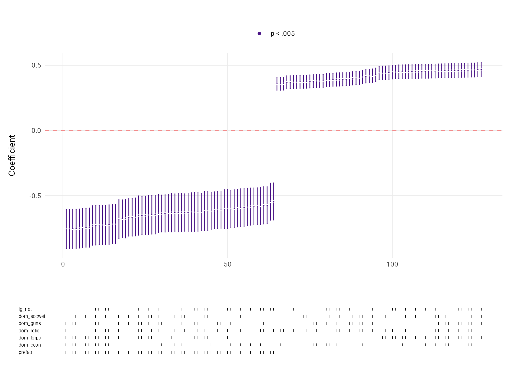
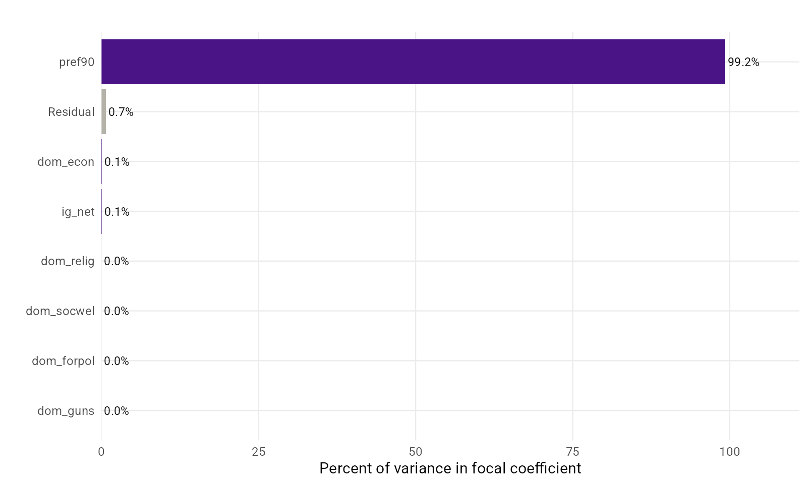

```{r, include = FALSE}
knitr::opts_chunk$set(
  collapse = TRUE,
  comment = "#>",
  fig.path = "man/figures/README-",
  out.width = "100%",
  dev = "ragg_png",
  dpi = 200
)

# Render the README figures in Roboto. The package itself stays font-agnostic
# (theme_sca() defaults to the device font); this option just opts these
# rendered figures into Roboto via the ragg device.
options(speccurvieR.base_family = "Roboto")

devtools::load_all()
load("data/bottles.RData")
```

# What is `speccurvieR`? 

<!-- badges: start -->
[](https://cran.r-project.org/package=speccurvieR)
[](https://cran.r-project.org/web/checks/check_results_speccurvieR.html)
[](https://cran.r-project.org/package=speccurvieR)
[](https://cran.r-project.org/package=speccurvieR)
<!-- badges: end -->

`speccurvieR` is an R package aimed at making specification curve analysis easy, fast, and pretty. When you fit a model you make a lot of choices–which controls to include, which fixed effects, which standard errors–and any of them could be moving your estimate. Specification curve analysis takes those choices seriously: it fits the model under every reasonable combination of them, plots the resulting curve of estimates, and lets you ask whether your result survives the choices you didn't make. `speccurvieR` runs that curve, tests it, and gets it into your paper, with `ggplot` graphics throughout.

# How do I install it?

`speccurvieR` is available [via CRAN](https://cran.r-project.org/package=speccurvieR), just run the following and you're good to go:

```{r, eval=FALSE}
install.packages("speccurvieR")

library(speccurvieR)
```

# How do I cite it?

If you find this package useful and use it in your own work, a citation would be greatly appreciated:

**Sember, Zayne. "speccurvier: Easy, Fast, and Pretty Specification Curve Analysis." doi:10.32614/CRAN.package.speccurvieR.**

# Why did you make it?

Data visualization and tinkering in `R` have been some of the most enjoyable parts of my time working on a PhD. The seeds for this package were planted when I took a course on replication in social science with Professor Gareth Nellis. An assignment involved performing a specification curve analysis for which the professor provided us with some code to generate a specification curve. Not feeling like modifying someone else's code to get the final plot looking how I wanted, I was disappointed to see the available packages weren't much better. My biggest gripe was their use of base `R` plots which aren't exactly the prettiest ducklings and for which customization is a confusing hassle. Give me my `ggplot`! I want to arrange all the grobs! Long story short I gave in and used the professor's code. Fast forward a couple years and I need to run a specification curve analysis but I can't find the assignment with the professor's code–guess I'll just write it myself.

`speccurvieR` builds on standard specification curve analysis (i.e. comparing coefficient estimates) by offering an easy way to compare different types of standard errors. To date no `R` package offers this functionality, leaving modelers to manually try different standard errors to check the robustness of their results . . . or more realistically to stick to IID standard errors or a single variety of heteroskedasticity-consistent errors.

# Why should I use it over other packages?

speccurvieR tries to do everything the other specification curve packages do, with the rough edges sanded down and better plots. Some of what sets it apart:

* Compare coefficient estimates and statistical significance across every combination of controls
* Compare standard error types–IID, heteroskedasticity-consistent, clustered, and bootstrapped–in a single call, for OLS and for `glm()` model families alike
* Diagnostic plots no other package offers: how inference shifts across standard error types (`plot_se()`, `plot_multi_se()`), which controls move your estimate (`plot_influence()`), and whether your best-fitting models are outliers (`plot_coef_fit()`)
* A joint-inference test (`sca_test()`) for whether the curve as a whole is more extreme than chance, with confound-preserving nulls for observational data and a per-specification multiple-comparison correction
* A variance decomposition (`sca_variance()`) that attributes the spread of estimates to each modelling choice
* A reporting layer–`tidy()`/`glance()`, a results table, and a one-paragraph write-up–so the curve drops straight into a manuscript
* A concise formula interface (`sca(y ~ x + control1 + control2 | fixed_effect, data)`) alongside the original argument interface
* An `n_obs` column and a `common_sample` option so a changing sample doesn't masquerade as a control effect
* Parallel computing and progress bars for large curves, and fixed effects via `fixest`
* Every plot is a `ggplot`, so customizing it is the customizing you already know

# Is this just a tool for p-hacking?

Any sensitivity analysis (or statistics in general) can be used for good or evil–specification curve analysis lets the researcher assess the robustness of their estimates by easily trying a variety of model specifications. Using this package to find a model specification with a significant p-value won't mean that result is robust or consistent with your theory. These tools are meant to allow you to demonstrate that you're *not* cherry-picking models!

# Can I see it in action?

I thought you'd never ask, let's walk through some examples.

## Estimating models

The main function of the package is `sca()` (short for specification curve analysis, not the music genre). This is where you specify the models you want estimated and get back a data frame with useful data for each model. This can then be fed to plotting functions like `plot_curve()` and `plot_rmse()`.

Let's look at the sample data provided with the package–[a sample of the CalCOFI bottle database](https://calcofi.org/data/oceanographic-data/bottle-database/) with plenty of variables to play around with.

```{r}
names(bottles)
```

Suppose we want to describe how ocean temperature relates to salinity, and how that association shifts as we add other water-chemistry controls. (Salinity and temperature are jointly determined by the same ocean physics, so there's no clean causal story here–which makes it a fitting toy for watching how unstable a single coefficient can be.)

```{r}
s <- sca(y = "T_degC", x = "Salnty",
             controls = c("O2Sat", "ChlorA", "NH3uM", "NO2uM",
                          "SiO3uM", "NO2uM*SiO3uM"),
             data = bottles)
```

If you prefer, you can specify the whole model with a formula instead. The first
right-hand-side term is taken as the independent variable, the rest as controls,
and anything after a `|` as fixed effects, so the call above is equivalent to:

```{r, eval=FALSE}
s <- sca(T_degC ~ Salnty + O2Sat + ChlorA + NH3uM + NO2uM + SiO3uM +
           NO2uM*SiO3uM, data = bottles)
```

The function returns a data frame containing a row for every possible combination of controls with all the information needed to generate plots.

Let's take a look at the first four rows and columns:

```{r}
s[1:4,1:4]
```

Lots of goodies in there, including the formula used to generate each model, indicator variables for the presence of each of the controls in that row's model, as well as the control coefficients for each model.

```{r}
names(s)
```

The output also includes `n_obs`, the number of observations each specification was fit on. This one is easy to overlook and it matters: with default listwise deletion, specifications with different controls can end up fit on different samples, so part of what looks like a control effect is really just the sample changing underneath you. `n_obs` makes that visible, `plot_samplesizes()` plots it, and `sca(..., common_sample = TRUE)` fits every specification on the same complete-case sample so the curve isn't confounded by which rows happened to have which variables.

## Plotting

Now let's plot the specification curve for our independent variable's coefficient

```{r}
plot_curve(s)
```

Here's how to read it. Each dot in the top panel is the salinity coefficient from one of the 63 models, sorted from most negative to most positive; the bars are 95% confidence intervals and the colour marks the p-value tier (see the legend). The red dashed line is zero. In the bottom panel each row is a control, and a tick means that control is included in the specification directly above it–so you can read off which choices produce the estimates on the left versus the right. The thing to notice is that the salinity coefficient swings from well below zero to well above it, even changing sign depending on which controls are in the model. That swing is exactly what specification curve analysis is built to expose, and it's why no single regression here should be trusted on its own.

You can get the bottom panel by itself using `plot_vars()`:

```{r}
plot_vars(s)
```

`plot_curve()` takes a `title` argument and a `plot_vars = FALSE` option to return just the curve. Because what comes back is a plain `ggplot`, you can restyle it however you like:

```{r}
library(ggplot2)

plot_curve(s, plot_vars = FALSE, title = "Salinity coefficient across specifications") +
      theme_minimal() +
      theme(legend.position = "bottom", legend.title = element_blank())
```

(One gotcha: if you customize the theme and the title gets clipped at the top, widen the plot margin with `+ theme(plot.margin = unit(c(5, 5, 5, 5), "points"))`.)

Let's see what other stuff we can plot.

We can look at model fits across models:

```{r}
plot_rmse(s)
```

```{r}
plot_r2_adj(s)
```

We can also look at the distributions of coefficients for our control
variables:

```{r}
plot_control_distributions(s)
```

Or maybe we want histograms:

```{r}
plot_control_distributions(s, type="histogram")
```

(Note: because the above plot is a facet wrapped `ggplot` object you can
customize it like any other `ggplot` object)

## Comparing standard errors

Specification curve analysis is usually about the coefficient, but the standard error is a modelling choice too. `se_compare()` re-estimates a model under several standard error types in a single call–as far as I know, the only spec-curve package that does–so you can see how much your inference leans on that choice:

```{r}
se_compare(formula = "Salnty ~ T_degC + ChlorA", data = bottles, types = "all")
```

(The estimate column is the coefficient, not a standard error.) It also does clustered and bootstrapped errors (pass `cluster`, or `boot_samples`/`boot_sample_size`), and fixed effects via `fixest`:

```{r, message=FALSE, warning=FALSE}
se_compare(formula = "Salnty ~ T_degC + ChlorA | Sta_ID", data = bottles,
           types = c("CL_FE", "iid", "HC0", "HC1"))
```

(`CL_FE` is clustered by the fixed-effect variable, i.e. the default `fixest::feols()` reports.) `cluster` takes either a character vector–one-way clustering by each variable–or a list, where each element names the dimensions to cluster on jointly, so you can ask for two-way (or higher) clustered errors, and even mix one- and two-way in a single call:

```{r}
se_compare(formula = "Salnty ~ T_degC + ChlorA", data = bottles,
           types = "HC1",
           cluster = list("Sta_ID", "Depth_ID", c("Sta_ID", "Depth_ID")))
```

And it isn't limited to OLS–pass a `family` (and optionally a `link`), exactly as you would to `sca()`, to compare standard error types for any `glm()` family, with every error type carrying over:

```{r, message=FALSE, warning=FALSE}
# A binary outcome for a quick logistic-regression example.
bottles$saline <- as.integer(bottles$Salnty > median(bottles$Salnty, na.rm = TRUE))

se_compare(formula = "saline ~ T_degC + ChlorA", data = bottles,
           family = "binomial", types = c("iid", "HC0", "HC3"))
```

The thing to watch for is a coefficient that's significant under one error type and not another–that's a robustness red flag. `plot_se()` makes it visual, drawing each coefficient's estimate with a confidence interval under every standard error type, coloured by whether the interval excludes zero:

```{r}
plot_se(se_compare("Salnty ~ T_degC + ChlorA + O2Sat", data = bottles,
                   types = c("iid", "HC0", "HC1", "HC3")))
```

And `plot_multi_se()` draws the whole specification curve faceted by standard error type. The estimates are identical across facets, so you can see exactly which specifications stay significant under each choice of standard error:

```{r}
plot_multi_se(y = "Salnty", x = "T_degC",
              controls = c("ChlorA", "O2Sat", "NO2uM"),
              data = bottles, types = c("iid", "HC3"))
```

## Diagnostic plots

A specification curve tells you the estimate moves, but not why. These plots try to answer that.

`plot_influence()` shows, for each control, how including versus excluding it shifts your independent variable's coefficient, which makes it easy to see which modelling choices are actually doing the moving:

```{r}
plot_influence(s)
```

`plot_coef_fit()` plots the coefficient against model fit, so you can check whether your best-fitting specifications give systematically different estimates–a useful thing to know before you lean on any one model:

```{r}
plot_coef_fit(s)
```

## Variance decomposition

A related question: of all the spread in the curve, how much is each control responsible for? `sca_variance()` decomposes the variance of the focal coefficient across the curve into the share attributable to each control (plus a residual for interactions among choices and unexplained variation). By default it uses an LMG / Shapley decomposition of R², whose shares sum exactly to the model R² and don't depend on the order you list the controls:

```{r}
sca_variance(s)
```

Read each share as how much of the curve's spread that control is responsible for–a control with a big share is one that genuinely moves your estimate ("Shapley" just means the credit is split fairly no matter what order you list the controls in). This complements `plot_influence()`: influence shows the *direction* each control pushes the estimate, the decomposition shows each control's *share* of the total spread.

`plot_variance()` shows the same thing as a bar chart:

```{r}
plot_variance(s)
```

## Joint-inference test

Reading a specification curve tells you whether your result is robust *descriptively*. But how do you know the curve as a whole is more extreme than you'd expect by chance? `sca_test()` answers that with the permutation-based joint-inference test of Simonsohn, Simmons, and Nelson (2020). It tests the *sharp null*–that the focal variable has no effect in *any* specification, not just on average–by repeatedly shuffling that variable (blocked within fixed effects when present), re-estimating the entire curve each time, and comparing the observed curve to the resulting null distribution.

The salinity curve above makes the descriptive point, but salinity's effect on temperature is so strong that every specification clears every bar–not much for an inference test to weigh. So for the inference tools I'll switch to a subtler relationship in the same data: how dissolved nitrate (`NO3uM`) tracks oxygen saturation (`O2Sat`), holding combinations of temperature, salinity, phosphate, and silicate fixed. The test reports three statistics, each with its own permutation *p*-value: the median estimate (is the typical coefficient far from zero?), the share of statistically significant specifications (are an unusual number of them significant?), and a Stouffer combination of the per-specification *p*-values (do the pooled *p*-values point the same way?).

```{r}
result <- sca_test(y = "O2Sat", x = "NO3uM",
                   controls = c("T_degC", "Salnty", "PO4uM", "SiO3uM"),
                   data = bottles, n_permutations = 500, seed = 1,
                   progress_bar = FALSE)
result
```

By the SSN rule printed there–reject when the median test *and* at least one of the other two are significant–this curve rejects the sharp null. But that's the default null, which shuffles the focal variable and so also breaks its correlation with the controls. That's fine for an experiment where the variable was randomly assigned; for observational data like this, where nitrate moves with the other nutrients, it's anti-conservative, so it's worth confirming with a design-preserving null. `null_type = "freedman_lane"` and `null_type = "residual_bootstrap"` hold the focal variable's correlation with the controls fixed (both are for linear models and fit every specification on a common sample):

```{r, message=FALSE}
result_fl <- sca_test(y = "O2Sat", x = "NO3uM",
                      controls = c("T_degC", "Salnty", "PO4uM", "SiO3uM"),
                      data = bottles, null_type = "freedman_lane",
                      n_permutations = 500, seed = 1, keep_curves = TRUE,
                      progress_bar = FALSE)
result_fl
```

The Freedman-Lane null rejects too, so the rejection isn't just an artifact of breaking nitrate's correlation with the controls–the curve as a whole really is more extreme than chance. `plot_sca_test()` unpacks the test into one panel per statistic. In each, the histogram is that statistic's distribution across the 500 permuted curves–its spread when the focal variable has no effect–and the vertical line is the value the real curve produced, with the *p*-value giving the share of permutations at least as extreme:

```{r}
plot_sca_test(result_fl)
```

All three land well out in their tails: the median estimate is comfortably negative, the share of significant specifications is pinned at one (every specification clears *p* < .05 on its own), and the Stouffer combination is extreme (Z = -23) because all fifteen point the same way. Whether all fifteen *stay* significant once you correct for having searched them is the next question.

### Which specifications are real?

The joint test asks whether the curve as a whole is real. The natural follow-up is *which* specifications are. To get per-specification answers, run `sca_test()` with `keep_curves = TRUE` and a design-preserving null (as above) and they're attached automatically. You can't just read the per-specification *p*-values off the curve and report the significant ones, though–with dozens of correlated specifications, some are bound to look significant by chance. That's the *family-wise error rate* problem: the chance that *any* of your specifications is a false positive, the same multiple-comparisons issue you know from running many tests at once.

`speccurvieR` corrects for it with the min-P / max-statistic permutation method of Westfall and Young (1993): it reuses the permutations the joint test already ran and, for each one, records the most extreme specification anywhere in the curve–the null distribution of "the best result a search could turn up by chance"–then compares each specification to its own null.

```{r}
as.data.frame(result_fl, what = "specs")
```

`p_raw` is each specification's uncorrected *p*-value against its own null, `p_adj` is the corrected one, and `significant_adj` flags the survivors. `plot_sca_test_specs()` draws each specification's estimate against its own null band and colours the points by tier–within the band, beyond it but not significant after correction, and significant after correction:

```{r}
plot_sca_test_specs(result_fl)
```

Here the correction changes the answer. Eight of the fifteen specifications survive it and seven don't, and the split isn't where the estimates alone would point you: the specifications that leave out phosphate (`PO4uM`) give the *largest* nitrate coefficients–around -2 to -3, against about -1 once phosphate is in–but those large estimates have wide null bands and don't hold up. The `Salnty + SiO3uM + T_degC` row is the one worth pausing on: its raw *p*-value is 0.036, individually significant, but corrected it's 0.15. On its own it looks real; once you account for having searched all fifteen specifications, it isn't. The eight that survive are exactly the ones that control for phosphate, and they settle on a smaller, steadier estimate.

That's the division of labour worth keeping straight: the joint test says whether the curve as a whole beats chance, and the per-specification correction says *which* specifications you can quote on their own. Here they're consistent–the curve is robust, and eight specifications carry it–but the correction adds the part a single *p*-value hides, that the biggest-looking estimates are the least trustworthy ones.

`sca_minp()` recomputes the adjustment without re-running the permutations, if you want the more powerful Westfall-Young step-down procedure or a different threshold. And one caveat worth stating outright: a flagged specification means an association beyond its own conditional null, not a causal effect of the size it reports–leaving a confounder out reroutes part of the coefficient, and the correction doesn't undo that.

## Reporting and export

Once you've estimated and tested a curve, you have to get it into a paper. The package speaks the usual `tidy()`/`glance()` dialect–the same generics `broom` and `modelsummary` dispatch on, so no `broom` dependency–for both `sca()` curves and `sca_test()` results:

```{r}
tidy(result_fl)
```

`sca_table()` renders a compact results block. It returns a plain, dependency-free data frame by default, but it can also render to Markdown, LaTeX, or `gt`/`kableExtra`/`flextable` if you have the package installed:

```{r}
sca_table(result_fl)
```

And `sca_report()` writes a one-paragraph, manuscript-ready summary:

```{r}
sca_report(result_fl)
```

The report states both answers from above in one place: the joint test rejected the null, and after correction eight of the fifteen specifications remain significant. The first is the verdict on the curve as a whole; the second tells you how many individual specifications you can stand behind.

# Trying it on a published study

The oceanographic data keeps the examples self-contained, but specification curves earn their keep on the observational data social scientists actually argue over. Here is the package on one such case–Gilens and Page's (2014) study of whose preferences predict federal policy change, run on their own replication data. The outcome is whether a proposed policy change was adopted within four years, so this is a logistic curve. To be clear up front: this is an illustration of the tooling, not a verdict on the paper, and I come back to that distinction at the end.

The question is whether the preferences of the average (50th-percentile) citizen predict adoption once you also account for the preferences of the affluent (90th percentile). The complication–which Gilens and Page note themselves, and which Bashir (2015) examines closely–is that those two measures correlate at about .94. A specification curve is a direct way to see what that does to the estimate.

```{r, eval = FALSE}
# Gilens & Page (2014) replication file (Perspectives on Politics supplement,
# doi:10.1017/S1537592714001595). adopted = policy change within four years;
# pref50 / pref90 = logit of the imputed % of 50th / 90th income-percentile
# citizens favoring a change; ig_net = net interest-group alignment.
gp <- haven::read_dta("S1537592714001595sup006.dta")   # plus the recode described above

s <- sca(y = "adopted", x = "pref50",
         controls = c("pref90", "ig_net", "dom_econ", "dom_socwel",
                      "dom_forpol", "dom_relig", "dom_guns"),
         data = gp, family = "binomial", common_sample = TRUE)
plot_curve(s)
```

```{r, echo = FALSE, out.width = "100%"}

```

The focal coefficient is significant in every one of the 127 specifications–and it lands on both sides of zero. Including the affluent-citizen measure pushes it negative; dropping it pushes it positive. `sca_variance()` says where that movement comes from:

```{r, eval = FALSE}
plot_variance(s)
```

```{r, echo = FALSE, out.width = "100%"}

```

A single control–the affluent-citizen measure–accounts for 99% of the variation in the average-citizen coefficient. That is the signature of two regressors too collinear to separate: the sign of either one "net of" the other is settled by whether you include it, not by the data. It is also a case where `sca_test()` misleads on its own–it reports a robust effect, because the coefficient is reliably "different from zero"; it just isn't reliably "signed". The curve shows that at a glance where a single p-value buries it.

One caveat, in both directions, since this is someone else's careful work. None of this overturns Gilens and Page's broader argument: economic elites and organized groups track adopted policy more closely than average citizens do, and that asymmetry holds across the curve. What the curve shows is narrower–the specific average-citizen coefficient can't be identified apart from a measure it is 94% redundant with, so reading its sign or significance off any one specification claims more than the data support. Surfacing that, rather than hiding it behind a single chosen model, is the point of the package.

# Other features

## Fixed effects with `fixest::feols`

Pass the name of your fixed effects variable(s) when calling `sca()` or `se_compare()` and all models will be run with `feols()` from the `fixest` package!

## Parallel computing

`sca()` uses the `parallel` package to offer parallel computing when estimating models. Simply set `parallel = TRUE` and the number of workers you want, i.e. `workers = 2`.

Note: parallelization is only recommended for specification curve analysis involving very large (>1000) numbers of models--for less intensive tasks parallelization will actually slow down model estimation.

## Getting formulae

If you hate the plotting functions I've made or need something from the model not provided by the default output of `sca()` you can always have it just return a list of all possible formulae with
`return_formulae = TRUE`:

```{r}
formulae <- sca(y = "T_degC", x = "Salnty",
         controls = c("O2Sat", "NO2uM", "SiO3uM"),
         data = bottles, return_formulae = TRUE)

# 7 formulae in all; here are the first three:
formulae[1:3]
```

Then it's easy to estimate the models yourself with the pre-made
formulae:

```{r}
my_own_models <- lapply(formulae, lm, data = bottles)

coef(summary(my_own_models[[1]]))
```

# What's next?

Feel free to contact me at [zayne@mit.edu](mailto:zayne@mit.edu) to let me know of features you would find useful. Some directions I may add next:

* Support for pre-fitted models and custom estimators (e.g. instrumental-variables and mixed models)

If you find a bug please create an issue on GitHub and I'll work to fix it ASAP.
