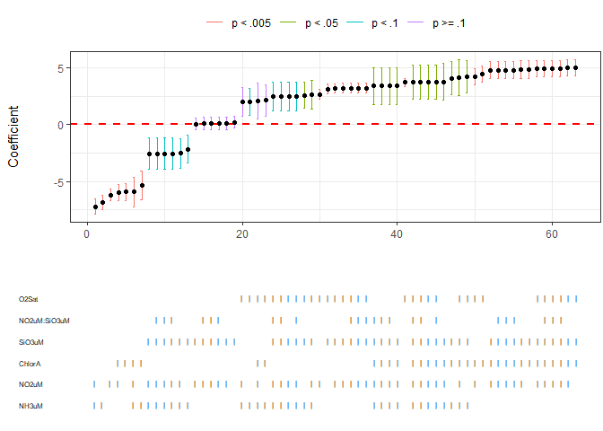
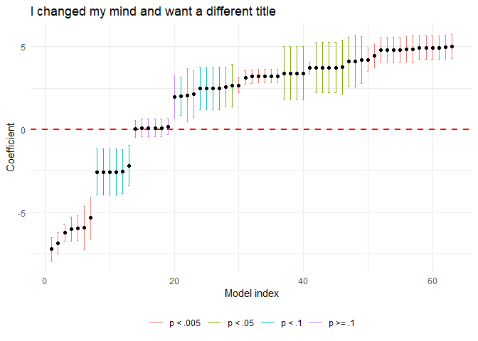
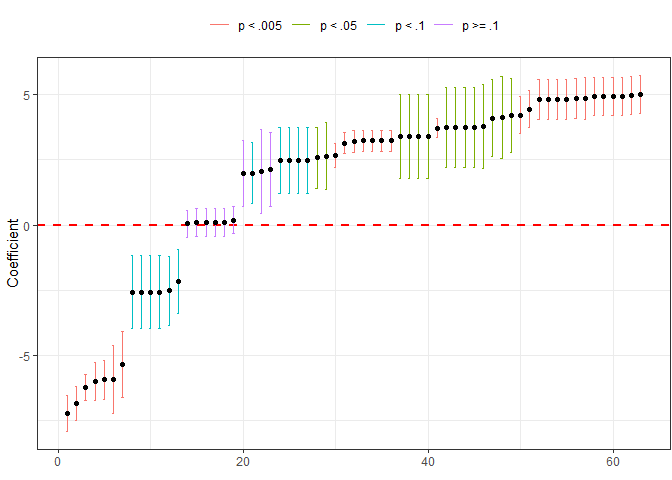
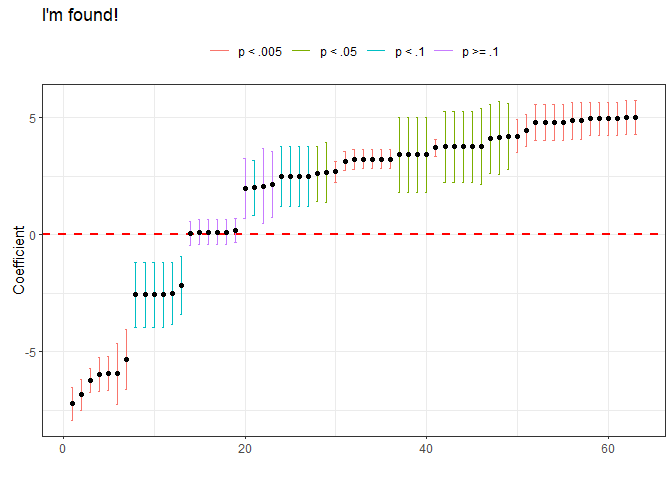
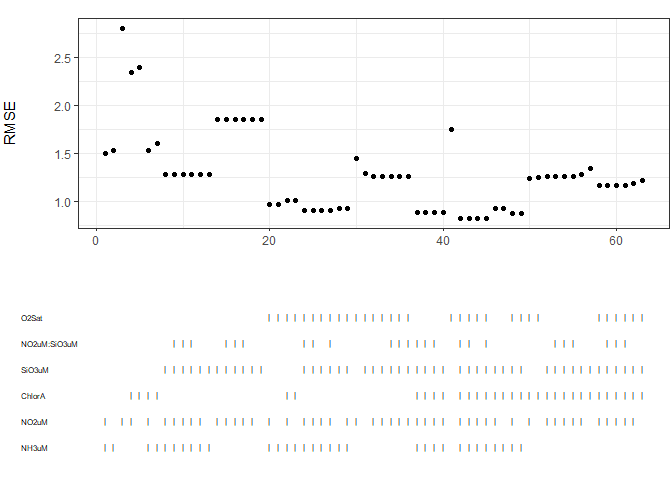
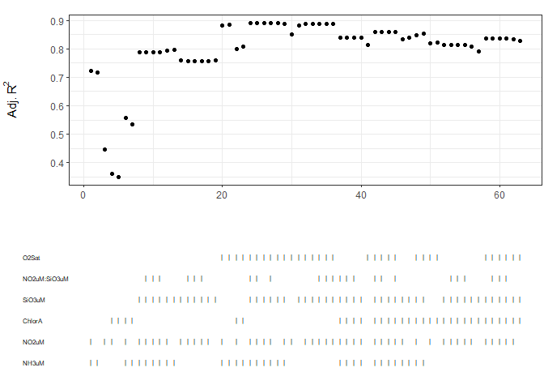
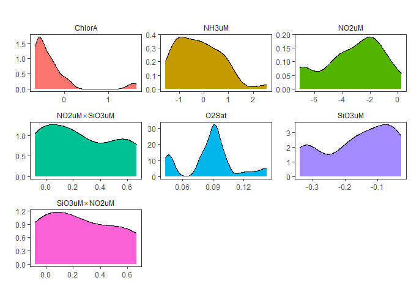

# What is `speccurvieR`?

`speccurvieR` is an R package aimed at making specification curve
analysis easy, fast, and pretty. In other words, it helps you understand
how your model changes under different specifications.

# How do I install it?

`speccurvieR` is available [via
CRAN](https://cran.r-project.org/package=speccurvieR), just run the
following and you’re good to go:

``` r
install.packages("speccurvieR")

library(speccurvieR)
```

# How do I cite it?

If you find this package useful and use it in your own work, a citation
would be greatly appreciated:

**Sember, Zayne. “speccurvier: Easy, Fast, and Pretty Specification
Curve Analysis.” <doi:10.32614/CRAN.package.speccurvieR>.**

# Why did you make it?

Data visualization and tinkering in `R` have been some of the most
enjoyable parts of my time working on a PhD. The seeds for this package
were planted when I took a course on replication in social science with
Professor Gareth Nellis. An assignment involved performing a
specification curve analysis for which the professor provided us with
some code to generate a specification curve. Not feeling like modifying
someone else’s code to get the final plot looking how I wanted, I was
disappointed to see the available packages weren’t much better. My
biggest gripe was their use of base `R` plots which aren’t exactly the
prettiest ducklings and for which customization is a confusing hassle.
Give me my `ggplot`! I want to arrange all the grobs! Long story short I
gave in and used the professor’s code. Fast forward a couple years and I
need to run a specification curve analysis but I can’t find the
assignment with the professor’s code–guess I’ll just write it myself.

Version 0.4.0 builds on standard specification curve analysis
(i.e. comparing coefficient estimates) by offering an easy way to
compare different types of standard errors. To date no `R` package
offers this functionality, leaving modelers to manually try different
standard errors to check the robustness of their results . . . or more
realistically to stick to IID standard errors or a single variety of
heteroskedasticity-consistent errors.

# Why should I use it over other packages?

speccurvieR seeks to provide everything alternative specification curve
analysis packages do with major improvements to usability and
visualization. Some features that set the package apart currently:

- Ability to compare coefficient estimates and statistical significance
  across model specifications
- Ability to compare different standard error estimates including
  heteroskedasticity-consistent, clustered, and bootstrapped
- Ability to compare various model fit parameters across models
- Support for parallel computing to speed up model estimation and
  progress bars to monitor model estimation
- Support for fixed effects
- All plots are generated using ggplot2, allowing a high degree of
  customization

# Is this just a tool for p-hacking?

Any sensitivity analysis (or statistics in general) can be used for good
or evil–specification curve analysis lets the researcher assess the
robustness of their estimates and by easily trying variety of model
specifications. Using this package to find a model specification with a
significant p-value won’t mean that result is a robust or consistent
with your theory. These tools are meant to allow you to demonstrate that
you’re *not* cherry-picking models!

# Can I see it in action?

I thought you’d never ask, let’s walk through some examples.

## Estimating models

The main function of the package is `sca()` (short for specification
curve analysis, not the music genre). This is where you specify the
models you want estimated and get back a data frame with useful data for
each model. This can then be fed to plotting functions like
`plotCurve()` and `plotRMSE()`.

Let’s look at the sample data provided with the package–[a sample of the
CalCOFI bottle
database](https://calcofi.org/data/oceanographic-data/bottle-database/)
with plenty of variables to play around with.

``` r
names(bottles)
#>  [1] "Cst_Cnt"             "Btl_Cnt"             "Sta_ID"             
#>  [4] "Depth_ID"            "Depthm"              "T_degC"             
#>  [7] "Salnty"              "O2ml_L"              "STheta"             
#> [10] "O2Sat"               "Oxy_µmol.Kg"         "BtlNum"             
#> [13] "RecInd"              "T_prec"              "T_qual"             
#> [16] "S_prec"              "S_qual"              "P_qual"             
#> [19] "O_qual"              "SThtaq"              "O2Satq"             
#> [22] "ChlorA"              "Chlqua"              "Phaeop"             
#> [25] "Phaqua"              "PO4uM"               "PO4q"               
#> [28] "SiO3uM"              "SiO3qu"              "NO2uM"              
#> [31] "NO2q"                "NO3uM"               "NO3q"               
#> [34] "NH3uM"               "NH3q"                "C14As1"             
#> [37] "C14A1p"              "C14A1q"              "C14As2"             
#> [40] "C14A2p"              "C14A2q"              "DarkAs"             
#> [43] "DarkAp"              "DarkAq"              "MeanAs"             
#> [46] "MeanAp"              "MeanAq"              "IncTim"             
#> [49] "LightP"              "R_Depth"             "R_TEMP"             
#> [52] "R_Sal"               "R_DYNHT"             "R_Nuts"             
#> [55] "R_Oxy_µmol.Kg"       "DIC1"                "DIC2"               
#> [58] "TA1"                 "TA2"                 "pH1"                
#> [61] "pH2"                 "DIC.Quality.Comment"
```

Suppose we’re modeling the effect of salinity on ocean temperatures and
want to understand how including the concentration of other chemicals
affects the model

``` r
s <- sca(y = "T_degC", x = "Salnty", 
             controls = c("O2Sat", "ChlorA", "NH3uM", "NO2uM", 
                          "SiO3uM", "NO2uM*SiO3uM"),
             data = bottles)
#> [1] Estimating 63 models
```

The function returns a data frame containing a row for every possible
combination of controls with all the information needed to generate
plots.

Let’s take a look at the first four rows and columns:

``` r
s[1:4,1:4]
#>                                       coef        se  statistic            p
#> T_degC ~ Salnty + NH3uM + NO2uM  -7.217658 0.6970881 -10.354011 2.259926e-13
#> T_degC ~ Salnty + NH3uM          -6.841309 0.6500327 -10.524561 1.023049e-13
#> T_degC ~ Salnty + NO2uM          -6.215102 0.5068112 -12.263152 4.988171e-26
#> T_degC ~ Salnty + ChlorA + NO2uM -5.978766 0.7286337  -8.205449 3.912279e-13
```

Lots of goodies in there, including the formula used to generate each
model, indicator variables for the presence of each of the controls in
that row’s model, as well as the control coefficients for each model.

``` r
names(s)
#>  [1] "coef"          "se"            "statistic"     "p"            
#>  [5] "RMSE"          "adjR"          "terms"         "control_coefs"
#>  [9] "sig.level"     "index"         "O2Sat"         "ChlorA"       
#> [13] "NH3uM"         "NO2uM"         "SiO3uM"        "NO2uM:SiO3uM"
```

## Plotting

Now let’s plot the specification curve for our independent variable’s
coefficient

``` r
plotCurve(s)
```



By default, a bottom panel is provided showing which controls are
present in each model. You can get the bottom panel by itself using
`plotVars()`:

``` r
plotVars(s)
```


You can also get just the top panel with the specification curve, add a
title, and more:

``` r
plotCurve(s, plotVars=F, title="Salinity Coefficient Specification Curve")
```


When `plotVars = FALSE` (i.e. when you are only having a single ggplot
object returned) you can also customize the plot as you would any
`ggplot` object:

``` r
library(ggplot2)
#> Warning: package 'ggplot2' was built under R version 4.3.3

plotCurve(s, plotVars=F, title="Salinity Coefficient Specification Curve") +
      theme_minimal() +
      theme(legend.position = "bottom", 
            legend.title = element_blank()) +
      labs(title = "I changed my mind and want a different title",
           x = "Model index")
```



Note you may need to adjust the plot’s margin when customizing like this
to avoid going off the plot’s edge, this can be done easily:

``` r
plotCurve(s, plotVars = F) +
      labs(title = "I'm missing")
```



``` r
plotCurve(s, plotVars = F) +
      theme(plot.margin = unit(c(5, 5, 5, 5), unit = "points")) +
      labs(title = "I'm found!")
```



Let’s see what other stuff we can plot.

We can look at model fits across models:

``` r
plotRMSE(s)
```



``` r
plotR2Adj(s)
```



We can also look at the distributions of coefficients for our control
variables:

``` r
plotControlDistributions(s)
```



Or maybe we want histograms:

``` r
plotControlDistributions(s, type="histogram")
#> `stat_bin()` using `bins = 30`. Pick better value with `binwidth`.
```


(Note: because the above plot is a facet wrapped `ggplot` object you can
customize it like any other `ggplot` object)

## Comparing standard errors

Suppose you want to investigate how your model fares with different
standard error types, `se_compare()` allows you to do so in a single
line of code:

``` r
se_compare(formula = "Salnty ~ T_degC + ChlorA", data = bottles, types = "all")
#>                  estimate         iid         HC0         HC1         HC2
#> (Intercept) 34.2940251811 0.097594017 0.107876468 0.109239172 0.109580346
#> T_degC      -0.0599783335 0.007428642 0.008370367 0.008476102 0.008516740
#> ChlorA       0.0006514447 0.012449618 0.005327664 0.005394963 0.007563932
#>                     HC3         HC4        HC4m        HC5
#> (Intercept) 0.111322464 0.110448767 0.111667385 0.10970114
#> T_degC      0.008669478 0.008665155 0.008715565 0.02225782
#> ChlorA      0.011852569 0.033524495 0.015191133 0.67019383
```

Note that the estimate column provides the coefficient estimate, not a
standard error estimate.

You can provide bootstrapping parameters if you want to investigate
bootstrapped errors:

``` r
se_compare(formula = "Salnty ~ T_degC + ChlorA", data = bottles, 
           types = c("iid", "bootstrapped"),
           bootSamples=c(8, 10), bootSampleSize=c(200, 300))
#>                  estimate         iid bootstrap_k8n200 bootstrap_k10n200
#> (Intercept) 34.2940251811 0.097594017       0.15622103       0.118853774
#> T_degC      -0.0599783335 0.007428642       0.01182771       0.009862705
#> ChlorA       0.0006514447 0.012449618       0.06291394       0.048310059
#>             bootstrap_k8n300 bootstrap_k10n300
#> (Intercept)       0.12172942       0.107378252
#> T_degC            0.01131272       0.008436476
#> ChlorA            0.02692236       0.023803066
```

Clustered standard errors are also supported:

``` r
se_compare(formula = "Salnty ~ T_degC + ChlorA", data = bottles, 
           types = "HC1", cluster=c("Sta_ID", "Depth_ID"))
#>                  estimate         HC1  HC1_Sta_ID HC1_Depth_ID
#> (Intercept) 34.2940251811 0.109239172 0.126354691  0.109239172
#> T_degC      -0.0599783335 0.008476102 0.009846441  0.008476102
#> ChlorA       0.0006514447 0.005394963 0.005415379  0.005394963
```

As well as fixed effects:

``` r
se_compare(formula = "Salnty ~ T_degC + ChlorA | Sta_ID", data = bottles, 
           types = c("CL_FE", "iid", "HC0", "HC1"))
#>              estimate_FE       CL_FE      estimate         iid         HC0
#> (Intercept)           NA          NA 34.2940251811 0.097594017 0.107876468
#> T_degC      -0.056560122 0.011605252 -0.0599783335 0.007428642 0.008370367
#> ChlorA      -0.003614691 0.007410004  0.0006514447 0.012449618 0.005327664
#>                     HC1
#> (Intercept) 0.109239172
#> T_degC      0.008476102
#> ChlorA      0.005394963
```

Note: CL_FE refers to standard errors clustered by fixed effects
variables, i.e. the default errors reported by `fixest::feols()`.

# Other features

## Fixed effects with `fixest::feols`

Pass the name of your fixed effects variable(s) when calling `sca()` or
`se_compare()` and all models will be run with `feols()` from the
`fixest` package!

## Parallel computing

`sca()` uses the `parallel` package to offer parallel computing when
estimating models. Simply set `parallel = TRUE` and the number of
workers you want, i.e. `workers = 2`.

Note: parallelization is only recommended for specification curve
analysis involving very large (\>1000) numbers of models–for less
intensive tasks parallelization will actually slow down model
estimation.

## Getting formulae

If you hate the plotting functions I’ve made or need something from the
model not provided by the default output of `sca()` you can always have
it just return a list of all possible formulae with
`returnFormulae = TRUE`:

``` r
formulae <- sca(y = "T_degC", x = "Salnty", 
         controls = c("O2Sat", "NO2uM", "SiO3uM"),
         data = bottles, returnFormulae = TRUE)

formulae
#> $`T_degC ~ Salnty + O2Sat`
#> T_degC ~ Salnty + O2Sat
#> <environment: 0x000001d4ba66cb20>
#> 
#> $`T_degC ~ Salnty + NO2uM`
#> T_degC ~ Salnty + NO2uM
#> <environment: 0x000001d4ba66cb20>
#> 
#> $`T_degC ~ Salnty + SiO3uM`
#> T_degC ~ Salnty + SiO3uM
#> <environment: 0x000001d4ba66cb20>
#> 
#> $`T_degC ~ Salnty + O2Sat + NO2uM`
#> T_degC ~ Salnty + O2Sat + NO2uM
#> <environment: 0x000001d4ba66cb20>
#> 
#> $`T_degC ~ Salnty + O2Sat + SiO3uM`
#> T_degC ~ Salnty + O2Sat + SiO3uM
#> <environment: 0x000001d4ba66cb20>
#> 
#> $`T_degC ~ Salnty + NO2uM + SiO3uM`
#> T_degC ~ Salnty + NO2uM + SiO3uM
#> <environment: 0x000001d4ba66cb20>
#> 
#> $`T_degC ~ Salnty + O2Sat + NO2uM + SiO3uM`
#> T_degC ~ Salnty + O2Sat + NO2uM + SiO3uM
#> <environment: 0x000001d4ba66cb20>
```

Then it’s easy to estimate the models yourself with the pre-made
formulae:

``` r
my_own_models <- lapply(formulae, lm, data = bottles)

summary(my_own_models[[1]])
#> 
#> Call:
#> FUN(formula = X[[i]], data = ..1)
#> 
#> Residuals:
#>     Min      1Q  Median      3Q     Max 
#> -7.9361 -0.8102  0.0100  0.8297  7.7782 
#> 
#> Coefficients:
#>               Estimate Std. Error t value Pr(>|t|)    
#> (Intercept) -122.25866   12.59424  -9.708   <2e-16 ***
#> Salnty         3.71490    0.36636  10.140   <2e-16 ***
#> O2Sat          0.13018    0.00426  30.559   <2e-16 ***
#> ---
#> Signif. codes:  0 '***' 0.001 '**' 0.01 '*' 0.05 '.' 0.1 ' ' 1
#> 
#> Residual standard error: 1.757 on 368 degrees of freedom
#>   (129 observations deleted due to missingness)
#> Multiple R-squared:  0.8137, Adjusted R-squared:  0.8127 
#> F-statistic: 803.9 on 2 and 368 DF,  p-value: < 2.2e-16
```

# What’s next?

Feel free to contact me at <zsember@ucsd.edu> to let me know of features
you would find useful. Currently, I hope to add the following:

- Plotting different types of standard errors
- Adding support for all `glm` models in `se_compare()`
- Tools to understand variation in coefficient estimates across model
  specifications.

If you find a bug please create and issue on GitHub and I’ll work to fix
it ASAP.
