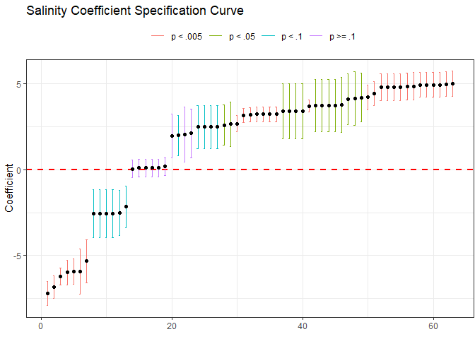
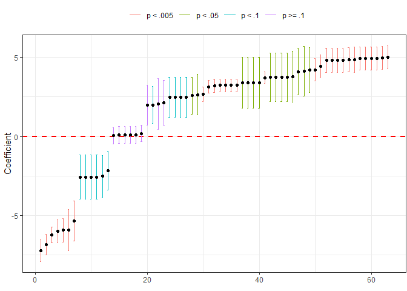
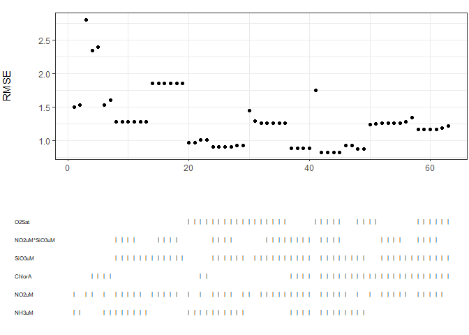
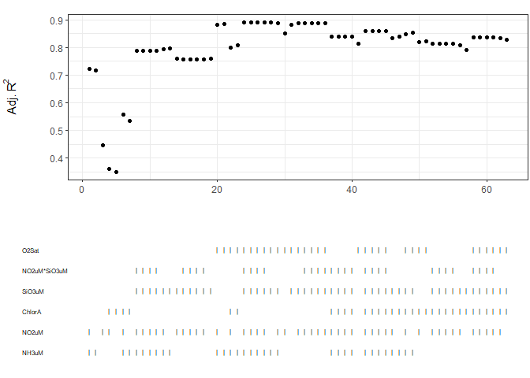
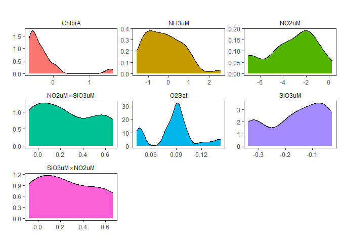
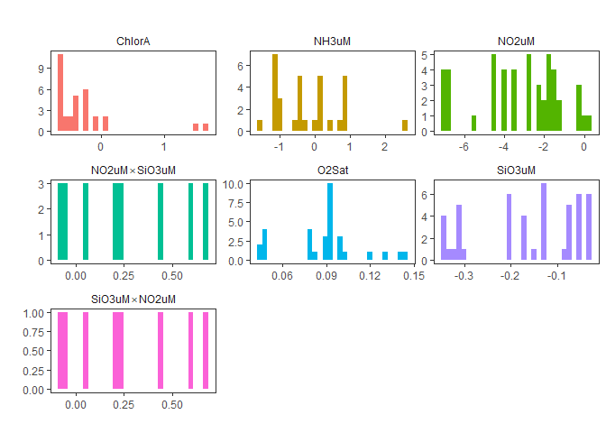

# What is `speccurvieR`?

`speccurvieR` is an R package aimed at making specification curve
analysis easy, fast, and pretty.

# How do I install it?

`speccurvieR` is available via CRAN simply do the following and you’re
good to go:

    install.packages("speccurvieR")

    library(speccurvieR)

# Why did you make it?

Data visualization and tinkering in R have been some of the most
enjoyable parts of my research as a PhD student. The seeds for this
package were planted when I took a course on replication in social
science with Professor Gareth Nellis. An assignment involved performing
a specification curve analysis for which the professor provided us with
some code to generate a specification curve. Not feeling like modifying
someone else’s code to get the final plot looking how I wanted, I was
disappointed to see the available packages weren’t much better. My
biggest gripe was their use of base `R` plots which aren’t exactly the
prettiest ducklings and for which customization is a confusing hassle.
Give me my `ggplot`! I want to arrange all the grobs! Long story short I
gave in and used the professor’s code. Fast forward a couple years and I
need to run a specification curve analysis but I can’t find the
assignment with the professor’s code–guess I’ll just write it myself.

# Why should I use it over other packages?

speccurvieR seeks to provide everything alternative specification curve
analysis packages do with major improvements to usability and
visualization. Some features that set the package apart currently: \*
Support for parallel computing to speed up model estimation \* Support
for fixed effects \* Support for clustered and robust standard errors \*
Progress bar to monitor model estimation \* All plots are generated
using ggplot2, allowing a high degree of customization \* Ability to
compare various model fit parameters across models

# Is this just a tool for p-hacking?

Any sensitivity analysis (or statistics in general) can be used for good
or evil–specification curve analysis lets the researcher assess the
robustness of their estimates and by easily trying variety of model
specifications. Using this package to find a model specification with a
significant p-value won’t mean that result is a robust or consistent
with your theory. These tools are meant to allow you to demonstrate that
you’re *not* cherry-picking models!

# Can I see it in action?

I thought you’d never ask, let’s walk through some examples.

# Estimating models

The main function of the package is `sca()` (short for specification
curve analysis, not the music). This is where you specify the models you
want estimated and get back a data frame with useful data for each model
that can then be fed to plotting functions like `plotCurve()` and
`plotRMSE()`.

Let’s look at the sample data provided with the package–[a sample of the
CalCOFI bottle
database](https://calcofi.org/data/oceanographic-data/bottle-database/).
Plenty of variables to play around with.

    names(bottles)

    ##  [1] "Cst_Cnt"             "Btl_Cnt"             "Sta_ID"             
    ##  [4] "Depth_ID"            "Depthm"              "T_degC"             
    ##  [7] "Salnty"              "O2ml_L"              "STheta"             
    ## [10] "O2Sat"               "Oxy_µmol.Kg"         "BtlNum"             
    ## [13] "RecInd"              "T_prec"              "T_qual"             
    ## [16] "S_prec"              "S_qual"              "P_qual"             
    ## [19] "O_qual"              "SThtaq"              "O2Satq"             
    ## [22] "ChlorA"              "Chlqua"              "Phaeop"             
    ## [25] "Phaqua"              "PO4uM"               "PO4q"               
    ## [28] "SiO3uM"              "SiO3qu"              "NO2uM"              
    ## [31] "NO2q"                "NO3uM"               "NO3q"               
    ## [34] "NH3uM"               "NH3q"                "C14As1"             
    ## [37] "C14A1p"              "C14A1q"              "C14As2"             
    ## [40] "C14A2p"              "C14A2q"              "DarkAs"             
    ## [43] "DarkAp"              "DarkAq"              "MeanAs"             
    ## [46] "MeanAp"              "MeanAq"              "IncTim"             
    ## [49] "LightP"              "R_Depth"             "R_TEMP"             
    ## [52] "R_Sal"               "R_DYNHT"             "R_Nuts"             
    ## [55] "R_Oxy_µmol.Kg"       "DIC1"                "DIC2"               
    ## [58] "TA1"                 "TA2"                 "pH1"                
    ## [61] "pH2"                 "DIC.Quality.Comment"

Suppose we’re modelling the effect of salinity on ocean temperatures and
want to understand how including the concentration of other chemicals
affects the model

    s <- sca(y = "T_degC", x = "Salnty", 
             controls = c("O2Sat", "ChlorA", "NH3uM", "NO2uM", 
                          "SiO3uM", "NO2uM*SiO3uM"),
             data = bottles)

    ## [1] Estimating 63 models

The function returns a data frame containing a row for every possible
combination of controls with all the information needed to generate
plots.

Let’s take a look at the first four rows and columns

    s[1:4,1:4]

    ##                                                             terms      coef
    ## T_degC ~ Salnty + NH3uM + NO2uM   T_degC ~ Salnty + NH3uM + NO2uM -7.217658
    ## T_degC ~ Salnty + NH3uM                   T_degC ~ Salnty + NH3uM -6.841309
    ## T_degC ~ Salnty + NO2uM                   T_degC ~ Salnty + NO2uM -6.215102
    ## T_degC ~ Salnty + ChlorA + NO2uM T_degC ~ Salnty + ChlorA + NO2uM -5.978766
    ##                                         se  statistic
    ## T_degC ~ Salnty + NH3uM + NO2uM  0.6970881 -10.354011
    ## T_degC ~ Salnty + NH3uM          0.6500327 -10.524561
    ## T_degC ~ Salnty + NO2uM          0.5068112 -12.263152
    ## T_degC ~ Salnty + ChlorA + NO2uM 0.7286337  -8.205449

Lots of goodies in there, including the formula used to generate each
model, indicator variables for the presence of each of the controls in
that row’s model, as well as the control coefficients for each model.

    names(s)

    ##  [1] "terms"         "coef"          "se"            "statistic"    
    ##  [5] "p"             "RMSE"          "adjR"          "control_coefs"
    ##  [9] "sig.level"     "index"         "O2Sat"         "ChlorA"       
    ## [13] "NH3uM"         "NO2uM"         "SiO3uM"        "NO2uM*SiO3uM"

# Plotting

Now let’s plot the specification curve for our independent variable’s
coefficient

    plotCurve(s)

By default, a bottom panel is provided showing which controls are
present in each model. You can get the bottom panel by itself using
`plotVars()`:

    plotVars(s)

You can also get just the top panel with the specification curve, add a
title, and more:

    plotCurve(s, plotVars=F, title="Salinity Coefficient Specification Curve")

When `plotVars = FALSE` (i.e. when you are only having a single ggplot
object returned) you can also customize the plot as you would any
`ggplot` object:

    plotCurve(s, plotVars=F, title="Salinity Coefficient Specification Curve") +
      theme_minimal() +
      theme(legend.position = "bottom", 
            legend.title = element_blank()) +
      labs(title = "I changed my mind and want a different title",
           x = "Model index")

Note you may need to adjust the plot’s margin when customizing like this
to avoid going off the plot’s edge, this can be done easily:

    plotCurve(s, plotVars = F) +
      labs(title = "I'm missing")

    plotCurve(s, plotVars = F) +
      theme(plot.margin = unit(c(5, 5, 5, 5), unit = "points")) +
      labs(title = "I'm found!")

Let’s see what other stuff we can plot.

We can look at model fits across models:

    plotRMSE(s)

    plotR2Adj(s)

We can also look at the distributions of coefficients for our control
variables:

    plotControlDistributions(s)

Or maybe we want histograms:

    plotControlDistributions(s, type="histogram")

(Note: because the above plot is a facet wrapped `ggplot` object you can
customize it like any other `ggplot` object)

# Other features

## Fixed effects with `lfe::felm()`

Pass the name of your fixed effects variable(s) when calling `sca()` and
all models will be run with `felm()` from the `lfe` package!

## Parallel computing

`sca()` uses the `parallel` package to offer parallel computing when
estimating models. Simply set `parallel = TRUE` and the number of
workers you want, i.e. `workers = 2`.

Note: parallelizing is only recommended for specification curve analysis
involving very large (&gt;1000) numbers of models–for smaller numbers
parallelization will actually slow down model estimation.

## Getting formulae

If you hate the plotting functions I’ve made or need something from the
model not provided by the default output of `sca()` you can always have
it just return a list of all possible formulae with
`returnFormulae = TRUE`:

    formulae <- sca(y = "T_degC", x = "Salnty", 
             controls = c("O2Sat", "NO2uM", "SiO3uM"),
             data = bottles, returnFormulae = TRUE)

    formulae

    ## $`T_degC ~ Salnty + O2Sat`
    ## T_degC ~ Salnty + O2Sat
    ## <environment: 0x000001cb0e8cc9c0>
    ## 
    ## $`T_degC ~ Salnty + NO2uM`
    ## T_degC ~ Salnty + NO2uM
    ## <environment: 0x000001cb0e8cc9c0>
    ## 
    ## $`T_degC ~ Salnty + SiO3uM`
    ## T_degC ~ Salnty + SiO3uM
    ## <environment: 0x000001cb0e8cc9c0>
    ## 
    ## $`T_degC ~ Salnty + O2Sat + NO2uM`
    ## T_degC ~ Salnty + O2Sat + NO2uM
    ## <environment: 0x000001cb0e8cc9c0>
    ## 
    ## $`T_degC ~ Salnty + O2Sat + SiO3uM`
    ## T_degC ~ Salnty + O2Sat + SiO3uM
    ## <environment: 0x000001cb0e8cc9c0>
    ## 
    ## $`T_degC ~ Salnty + NO2uM + SiO3uM`
    ## T_degC ~ Salnty + NO2uM + SiO3uM
    ## <environment: 0x000001cb0e8cc9c0>
    ## 
    ## $`T_degC ~ Salnty + O2Sat + NO2uM + SiO3uM`
    ## T_degC ~ Salnty + O2Sat + NO2uM + SiO3uM
    ## <environment: 0x000001cb0e8cc9c0>

Then it’s easy to estimate the models yourself with the pre-made
formulae:

    my_own_models <- lapply(formulae, lm, data = bottles)

    summary(my_own_models[[1]])

    ## 
    ## Call:
    ## FUN(formula = X[[i]], data = ..1)
    ## 
    ## Residuals:
    ##     Min      1Q  Median      3Q     Max 
    ## -7.9361 -0.8102  0.0100  0.8297  7.7782 
    ## 
    ## Coefficients:
    ##               Estimate Std. Error t value Pr(>|t|)    
    ## (Intercept) -122.25866   12.59424  -9.708   <2e-16 ***
    ## Salnty         3.71490    0.36636  10.140   <2e-16 ***
    ## O2Sat          0.13018    0.00426  30.559   <2e-16 ***
    ## ---
    ## Signif. codes:  0 '***' 0.001 '**' 0.01 '*' 0.05 '.' 0.1 ' ' 1
    ## 
    ## Residual standard error: 1.757 on 368 degrees of freedom
    ##   (129 observations deleted due to missingness)
    ## Multiple R-squared:  0.8137, Adjusted R-squared:  0.8127 
    ## F-statistic: 803.9 on 2 and 368 DF,  p-value: < 2.2e-16
