# What is `speccurvieR`?

`speccurvieR` is an R package aimed at making specification curve
analysis easy, fast, and pretty. When you fit a model you make a lot of
choices–which controls to include, which fixed effects, which standard
errors–and any of them could be moving your estimate. Specification
curve analysis takes those choices seriously: it fits the model under
every reasonable combination of them, plots the resulting curve of
estimates, and lets you ask whether your result survives the choices you
didn’t make. `speccurvieR` runs that curve, tests it, and gets it into
your paper, with `ggplot` graphics throughout.

# How do I install it?

`speccurvieR` is available [via
CRAN](https://cran.r-project.org/package=speccurvieR), just run the
following and you’re good to go:

``` r
install.packages("speccurvieR")

library(speccurvieR)
```

# How do I cite it?

If you find this package useful and use it in your own work, a citation
would be greatly appreciated:

**Sember, Zayne. “speccurvier: Easy, Fast, and Pretty Specification
Curve Analysis.” <doi:10.32614/CRAN.package.speccurvieR>.**

# Why did you make it?

Data visualization and tinkering in `R` have been some of the most
enjoyable parts of my time working on a PhD. The seeds for this package
were planted when I took a course on replication in social science with
Professor Gareth Nellis. An assignment involved performing a
specification curve analysis for which the professor provided us with
some code to generate a specification curve. Not feeling like modifying
someone else’s code to get the final plot looking how I wanted, I was
disappointed to see the available packages weren’t much better. My
biggest gripe was their use of base `R` plots which aren’t exactly the
prettiest ducklings and for which customization is a confusing hassle.
Give me my `ggplot`! I want to arrange all the grobs! Long story short I
gave in and used the professor’s code. Fast forward a couple years and I
need to run a specification curve analysis but I can’t find the
assignment with the professor’s code–guess I’ll just write it myself.

`speccurvieR` builds on standard specification curve analysis
(i.e. comparing coefficient estimates) by offering an easy way to
compare different types of standard errors. To date no `R` package
offers this functionality, leaving modelers to manually try different
standard errors to check the robustness of their results . . . or more
realistically to stick to IID standard errors or a single variety of
heteroskedasticity-consistent errors.

# Why should I use it over other packages?

speccurvieR tries to do everything the other specification curve
packages do, with the rough edges sanded down and better plots. Some of
what sets it apart:

- Compare coefficient estimates and statistical significance across
  every combination of controls
- Compare standard error types–IID, heteroskedasticity-consistent,
  clustered, and bootstrapped–in a single call, for OLS and for `glm()`
  model families alike
- Diagnostic plots no other package offers: how inference shifts across
  standard error types (`plot_se()`, `plot_multi_se()`), which controls
  move your estimate (`plot_influence()`), and whether your best-fitting
  models are outliers (`plot_coef_fit()`)
- A joint-inference test (`sca_test()`) for whether the curve as a whole
  is more extreme than chance, with confound-preserving nulls for
  observational data and a per-specification multiple-comparison
  correction
- A variance decomposition (`sca_variance()`) that attributes the spread
  of estimates to each modelling choice
- A reporting layer–`tidy()`/`glance()`, a results table, and a
  one-paragraph write-up–so the curve drops straight into a manuscript
- A concise formula interface
  (`sca(y ~ x + control1 + control2 | fixed_effect, data)`) alongside
  the original argument interface
- An `n_obs` column and a `common_sample` option so a changing sample
  doesn’t masquerade as a control effect
- Parallel computing and progress bars for large curves, and fixed
  effects via `fixest`
- Every plot is a `ggplot`, so customizing it is the customizing you
  already know

# Is this just a tool for p-hacking?

Any sensitivity analysis (or statistics in general) can be used for good
or evil–specification curve analysis lets the researcher assess the
robustness of their estimates by easily trying a variety of model
specifications. Using this package to find a model specification with a
significant p-value won’t mean that result is robust or consistent with
your theory. These tools are meant to allow you to demonstrate that
you’re *not* cherry-picking models!

# Can I see it in action?

I thought you’d never ask, let’s walk through some examples.

## Estimating models

The main function of the package is `sca()` (short for specification
curve analysis, not the music genre). This is where you specify the
models you want estimated and get back a data frame with useful data for
each model. This can then be fed to plotting functions like
`plot_curve()` and `plot_rmse()`.

Let’s look at the sample data provided with the package–[a sample of the
CalCOFI bottle
database](https://calcofi.org/data/oceanographic-data/bottle-database/)
with plenty of variables to play around with.

``` r
names(bottles)
#>  [1] "Cst_Cnt"             "Btl_Cnt"             "Sta_ID"             
#>  [4] "Depth_ID"            "Depthm"              "T_degC"             
#>  [7] "Salnty"              "O2ml_L"              "STheta"             
#> [10] "O2Sat"               "Oxy_µmol.Kg"         "BtlNum"             
#> [13] "RecInd"              "T_prec"              "T_qual"             
#> [16] "S_prec"              "S_qual"              "P_qual"             
#> [19] "O_qual"              "SThtaq"              "O2Satq"             
#> [22] "ChlorA"              "Chlqua"              "Phaeop"             
#> [25] "Phaqua"              "PO4uM"               "PO4q"               
#> [28] "SiO3uM"              "SiO3qu"              "NO2uM"              
#> [31] "NO2q"                "NO3uM"               "NO3q"               
#> [34] "NH3uM"               "NH3q"                "C14As1"             
#> [37] "C14A1p"              "C14A1q"              "C14As2"             
#> [40] "C14A2p"              "C14A2q"              "DarkAs"             
#> [43] "DarkAp"              "DarkAq"              "MeanAs"             
#> [46] "MeanAp"              "MeanAq"              "IncTim"             
#> [49] "LightP"              "R_Depth"             "R_TEMP"             
#> [52] "R_Sal"               "R_DYNHT"             "R_Nuts"             
#> [55] "R_Oxy_µmol.Kg"       "DIC1"                "DIC2"               
#> [58] "TA1"                 "TA2"                 "pH1"                
#> [61] "pH2"                 "DIC.Quality.Comment"
```

Suppose we’re modeling the effect of salinity on ocean temperatures and
want to understand how including the concentration of other chemicals
affects the model

``` r
s <- sca(y = "T_degC", x = "Salnty",
             controls = c("O2Sat", "ChlorA", "NH3uM", "NO2uM",
                          "SiO3uM", "NO2uM*SiO3uM"),
             data = bottles)
#> [1] Estimating 63 models
```

If you prefer, you can specify the whole model with a formula instead.
The first right-hand-side term is taken as the independent variable, the
rest as controls, and anything after a `|` as fixed effects, so the call
above is equivalent to:

``` r
s <- sca(T_degC ~ Salnty + O2Sat + ChlorA + NH3uM + NO2uM + SiO3uM +
           NO2uM*SiO3uM, data = bottles)
```

The function returns a data frame containing a row for every possible
combination of controls with all the information needed to generate
plots.

Let’s take a look at the first four rows and columns:

``` r
s[1:4,1:4]
#>                                       coef        se  statistic            p
#> T_degC ~ Salnty + NH3uM + NO2uM  -7.217658 0.6970881 -10.354011 2.259926e-13
#> T_degC ~ Salnty + NH3uM          -6.841309 0.6500327 -10.524561 1.023049e-13
#> T_degC ~ Salnty + NO2uM          -6.215102 0.5068112 -12.263152 4.988171e-26
#> T_degC ~ Salnty + ChlorA + NO2uM -5.978766 0.7286337  -8.205449 3.912279e-13
```

Lots of goodies in there, including the formula used to generate each
model, indicator variables for the presence of each of the controls in
that row’s model, as well as the control coefficients for each model.

``` r
names(s)
#>  [1] "coef"          "se"            "statistic"     "p"            
#>  [5] "RMSE"          "adjR"          "terms"         "control_coefs"
#>  [9] "n_obs"         "sig.level"     "index"         "O2Sat"        
#> [13] "ChlorA"        "NH3uM"         "NO2uM"         "SiO3uM"       
#> [17] "NO2uM:SiO3uM"
```

The output also includes `n_obs`, the number of observations each
specification was fit on. This one is easy to overlook and it matters:
with default listwise deletion, specifications with different controls
can end up fit on different samples, so part of what looks like a
control effect is really just the sample changing underneath you.
`n_obs` makes that visible, `plot_samplesizes()` plots it, and
`sca(..., common_sample = TRUE)` fits every specification on the same
complete-case sample so the curve isn’t confounded by which rows
happened to have which variables.

## Plotting

Now let’s plot the specification curve for our independent variable’s
coefficient

``` r
plot_curve(s)
```

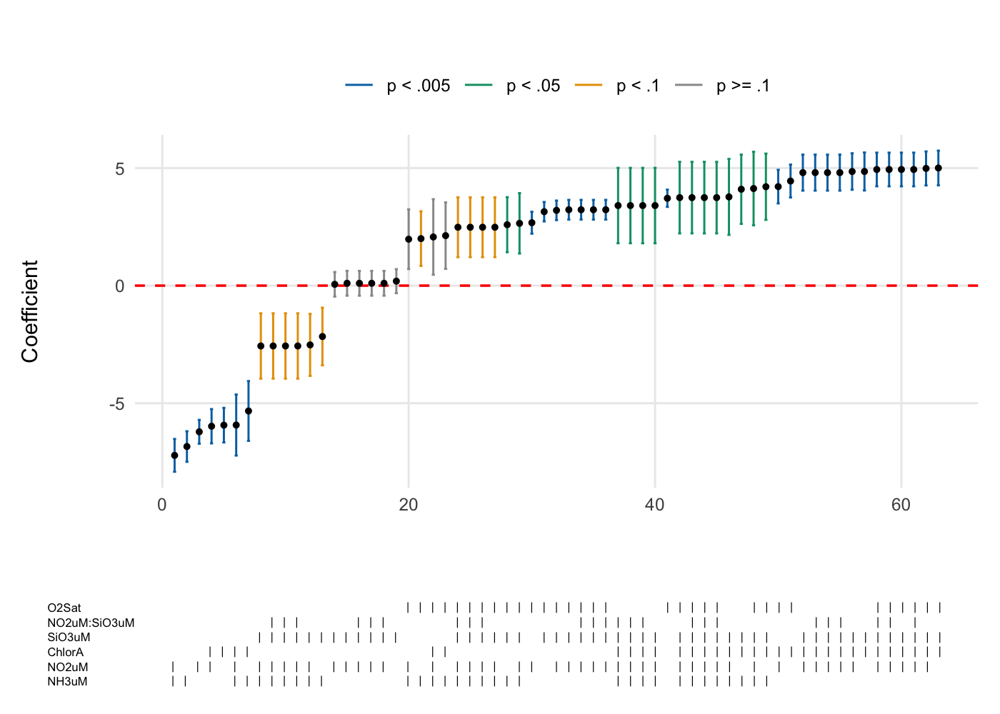

By default, a bottom panel is provided showing which controls are
present in each model. You can get the bottom panel by itself using
`plot_vars()`:

``` r
plot_vars(s)
```


You can also get just the top panel with the specification curve, add a
title, and more:

``` r
plot_curve(s, plot_vars=F, title="Salinity Coefficient Specification Curve")
```

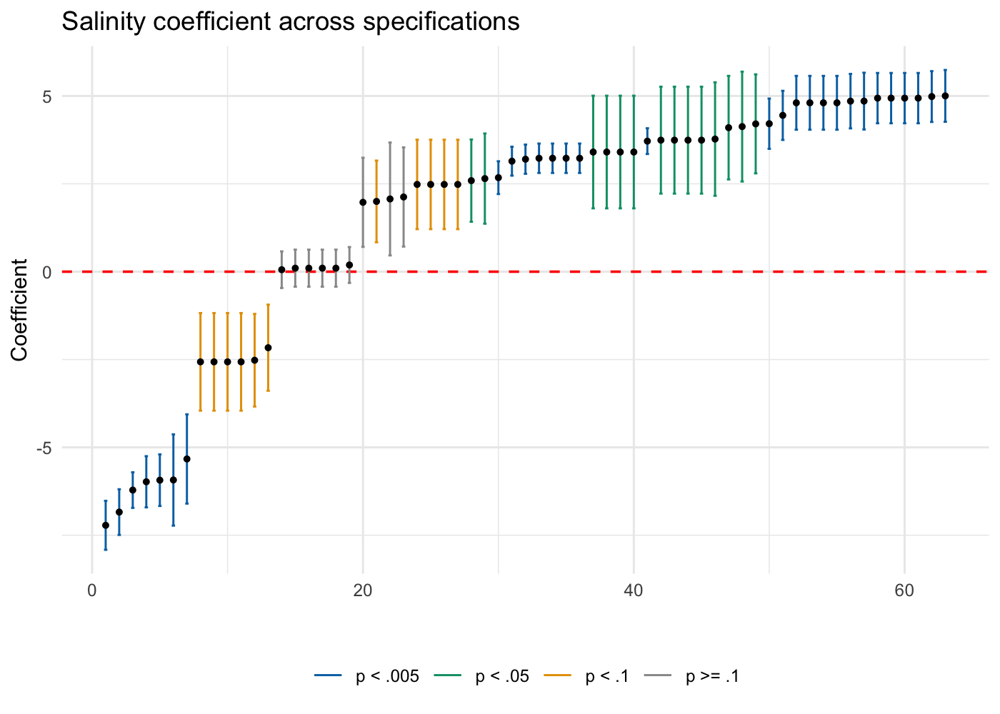

When `plot_vars = FALSE` (i.e. when you are only having a single ggplot
object returned) you can also customize the plot as you would any
`ggplot` object:

``` r
library(ggplot2)

plot_curve(s, plot_vars=F, title="Salinity Coefficient Specification Curve") +
      theme_minimal() +
      theme(legend.position = "bottom",
            legend.title = element_blank()) +
      labs(title = "I changed my mind and want a different title",
           x = "Model index")
```

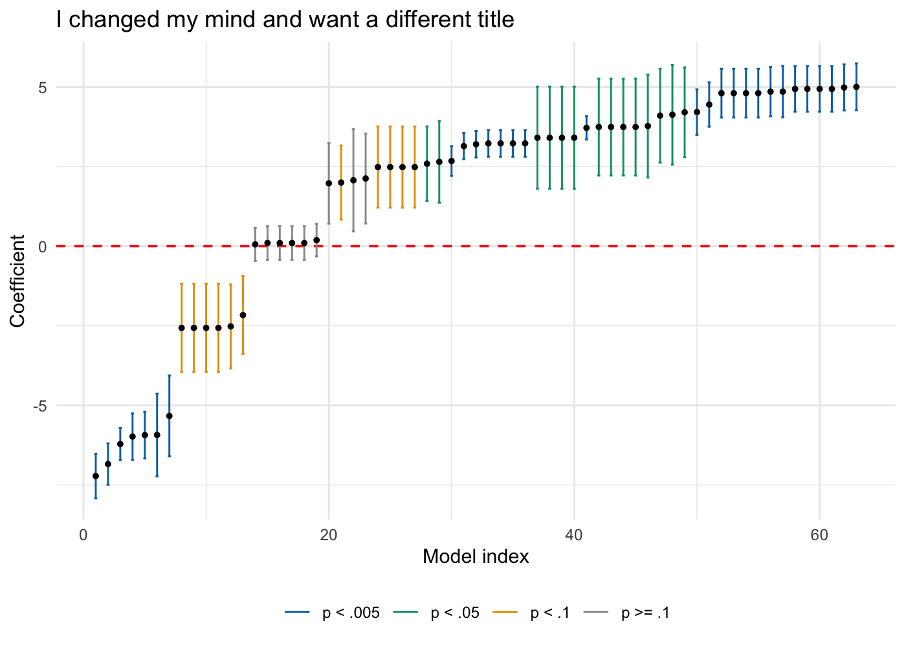

Note you may need to adjust the plot’s margin when customizing like this
to avoid going off the plot’s edge, this can be done easily:

``` r
plot_curve(s, plot_vars = F) +
      labs(title = "I'm missing")
```

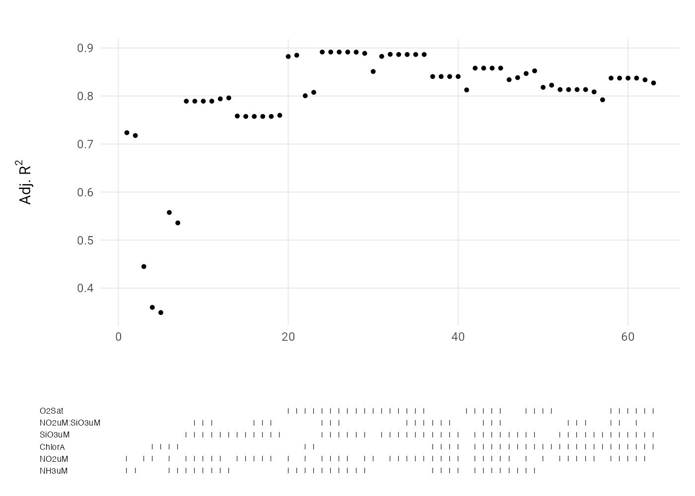

``` r
plot_curve(s, plot_vars = F) +
      theme(plot.margin = unit(c(5, 5, 5, 5), unit = "points")) +
      labs(title = "I'm found!")
```

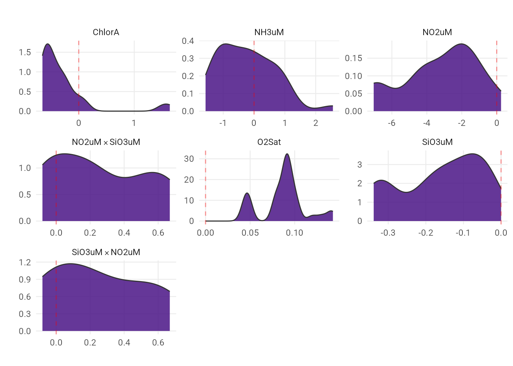

Let’s see what other stuff we can plot.

We can look at model fits across models:

``` r
plot_rmse(s)
```

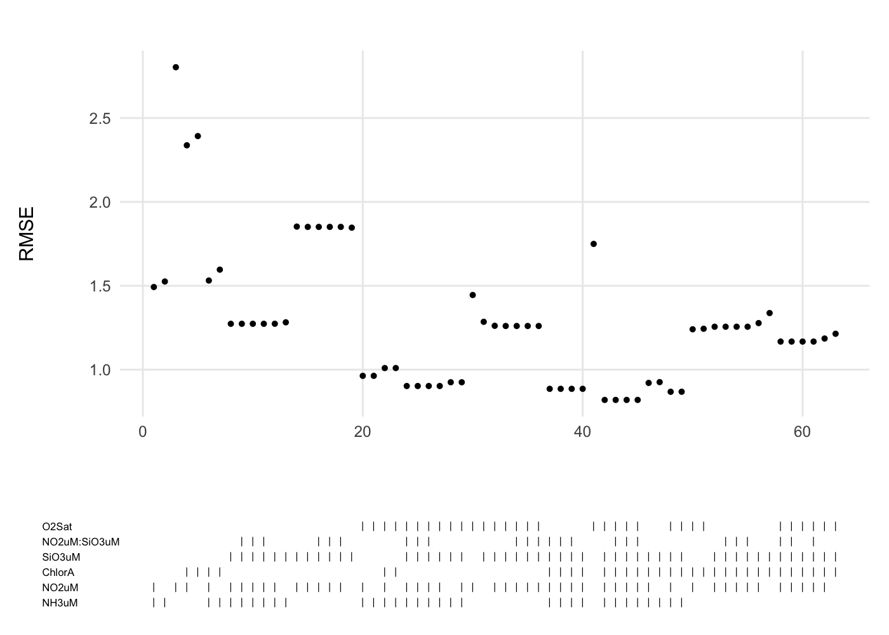

``` r
plot_r2_adj(s)
```

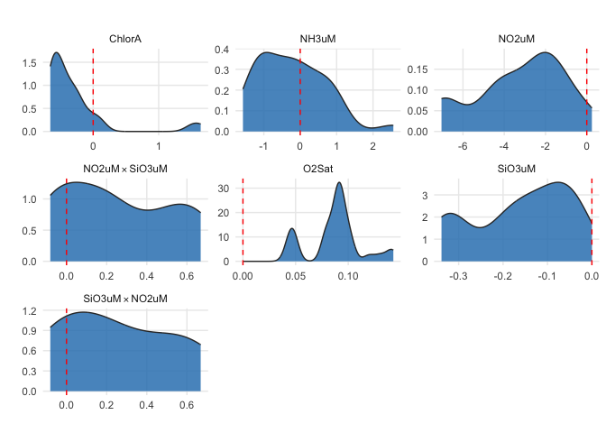

We can also look at the distributions of coefficients for our control
variables:

``` r
plot_control_distributions(s)
```

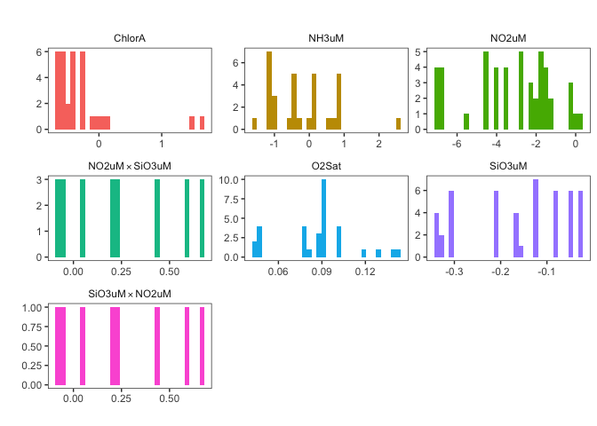

Or maybe we want histograms:

``` r
plot_control_distributions(s, type="histogram")
#> `stat_bin()` using `bins = 30`. Pick better value `binwidth`.
```

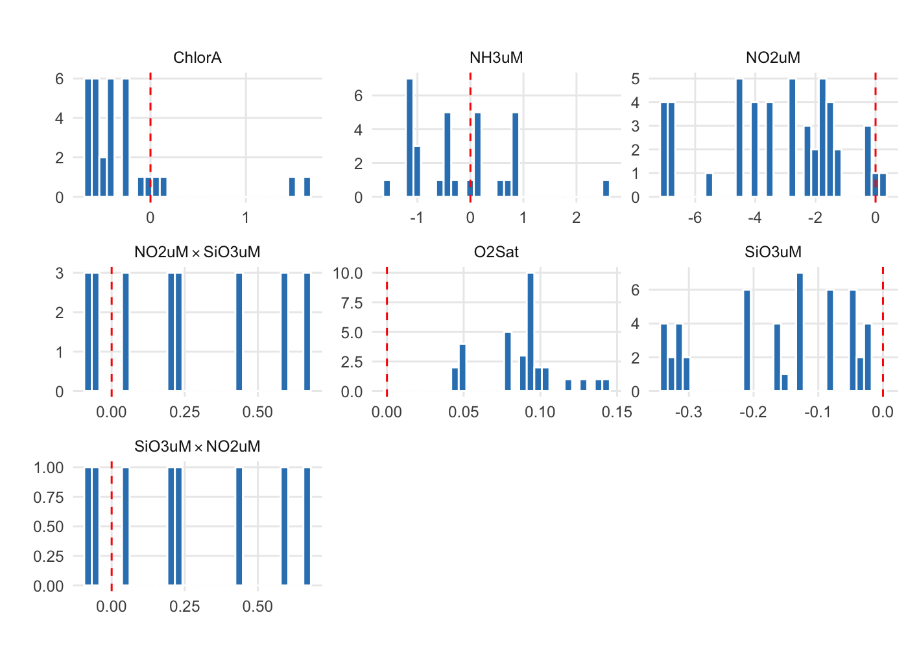

(Note: because the above plot is a facet wrapped `ggplot` object you can
customize it like any other `ggplot` object)

## Comparing standard errors

Suppose you want to investigate how your model fares with different
standard error types, `se_compare()` allows you to do so in a single
line of code:

``` r
se_compare(formula = "Salnty ~ T_degC + ChlorA", data = bottles, types = "all")
#>                  estimate         iid         HC0         HC1         HC2
#> (Intercept) 34.2940251811 0.097594017 0.107876468 0.109239172 0.109580346
#> T_degC      -0.0599783335 0.007428642 0.008370367 0.008476102 0.008516740
#> ChlorA       0.0006514447 0.012449618 0.005327664 0.005394963 0.007563932
#>                     HC3         HC4        HC4m        HC5
#> (Intercept) 0.111322464 0.110448767 0.111667385 0.10970114
#> T_degC      0.008669478 0.008665155 0.008715565 0.02225782
#> ChlorA      0.011852569 0.033524495 0.015191133 0.67019383
```

Note that the estimate column provides the coefficient estimate, not a
standard error estimate.

You can provide bootstrapping parameters if you want to investigate
bootstrapped errors:

``` r
se_compare(formula = "Salnty ~ T_degC + ChlorA", data = bottles,
           types = c("iid", "bootstrapped"),
           boot_samples=c(8, 10), boot_sample_size=c(200, 300))
#>                  estimate         iid bootstrap_k8n200 bootstrap_k10n200
#> (Intercept) 34.2940251811 0.097594017      0.104560339        0.11923059
#> T_degC      -0.0599783335 0.007428642      0.007827583        0.01011978
#> ChlorA       0.0006514447 0.012449618      0.051695174        0.03916491
#>             bootstrap_k8n300 bootstrap_k10n300
#> (Intercept)       0.14229854       0.100211550
#> T_degC            0.01235051       0.008024381
#> ChlorA            0.04176535       0.033771406
```

Clustered standard errors are also supported:

``` r
se_compare(formula = "Salnty ~ T_degC + ChlorA", data = bottles,
           types = "HC1", cluster=c("Sta_ID", "Depth_ID"))
#>                  estimate         HC1  HC1_Sta_ID HC1_Depth_ID
#> (Intercept) 34.2940251811 0.109239172 0.126354691  0.109239172
#> T_degC      -0.0599783335 0.008476102 0.009846441  0.008476102
#> ChlorA       0.0006514447 0.005394963 0.005415379  0.005394963
```

As well as fixed effects:

``` r
se_compare(formula = "Salnty ~ T_degC + ChlorA | Sta_ID", data = bottles,
           types = c("CL_FE", "iid", "HC0", "HC1"))
#>              estimate_FE       CL_FE      estimate         iid         HC0
#> (Intercept)           NA          NA 34.2940251811 0.097594017 0.107876468
#> T_degC      -0.056560122 0.011718722 -0.0599783335 0.007428642 0.008370367
#> ChlorA      -0.003614691 0.007482455  0.0006514447 0.012449618 0.005327664
#>                     HC1
#> (Intercept) 0.109239172
#> T_degC      0.008476102
#> ChlorA      0.005394963
```

Note: CL_FE refers to standard errors clustered by fixed effects
variables, i.e. the default errors reported by `fixest::feols()`.

`se_compare()` is not limited to OLS. Pass a `family` (and optionally a
`link`), exactly as you would to `sca()`, to compare standard error
types for any `glm()` model family–logistic regression, Poisson, and so
on. Every standard error type carries over, including bootstrapped and
clustered errors:

``` r
# A binary outcome for a quick logistic-regression example.
bottles$saline <- as.integer(bottles$Salnty > median(bottles$Salnty, na.rm = TRUE))

se_compare(formula = "saline ~ T_degC + ChlorA", data = bottles,
           family = "binomial", types = c("iid", "HC0", "HC3"))
#>               estimate      iid       HC0       HC3
#> (Intercept) 24.6937899 7.690972 6.0349157 6.3898863
#> T_degC      -2.6538943 0.814460 0.6444346 0.6820432
#> ChlorA       0.5100412 0.343188 0.1673462 0.4674847
```

You can visualize these comparisons too. `plot_se()` shows each
coefficient’s estimate with a confidence interval under every standard
error type, coloured by whether the interval excludes zero:

``` r
plot_se(se_compare("Salnty ~ T_degC + ChlorA + O2Sat", data = bottles,
                   types = c("iid", "HC0", "HC1", "HC3")))
```

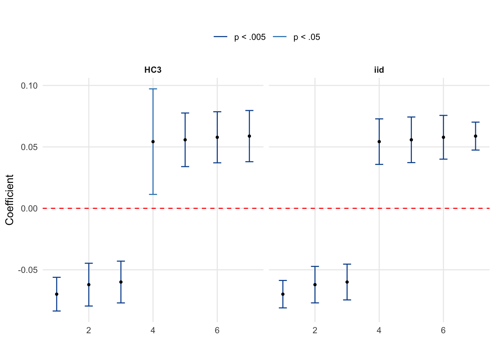

And `plot_multi_se()` draws the whole specification curve faceted by
standard error type. The estimates are identical across facets, so you
can see exactly which specifications stay significant under each choice
of standard error:

``` r
plot_multi_se(y = "Salnty", x = "T_degC",
              controls = c("ChlorA", "O2Sat", "NO2uM"),
              data = bottles, types = c("iid", "HC3"))
```

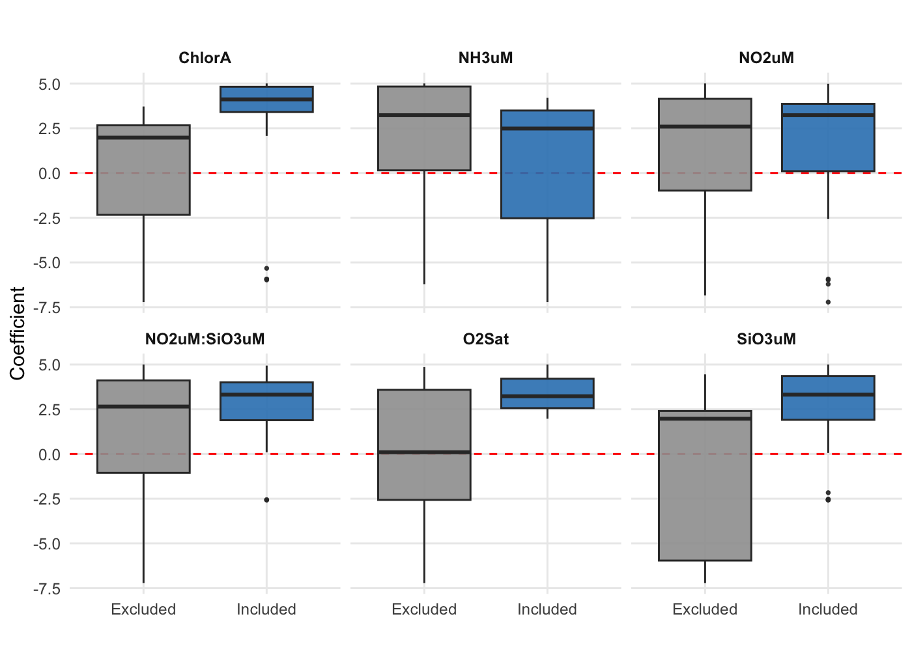

## Diagnostic plots

A specification curve tells you the estimate moves, but not why. These
plots try to answer that.

`plot_influence()` shows, for each control, how including versus
excluding it shifts your independent variable’s coefficient, which makes
it easy to see which modelling choices are actually doing the moving:

``` r
plot_influence(s)
```

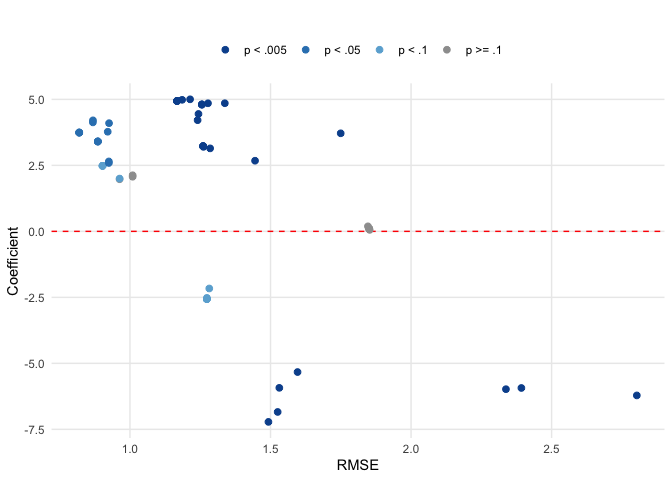

`plot_coef_fit()` plots the coefficient against model fit, so you can
check whether your best-fitting specifications give systematically
different estimates–a useful thing to know before you lean on any one
model:

``` r
plot_coef_fit(s)
```

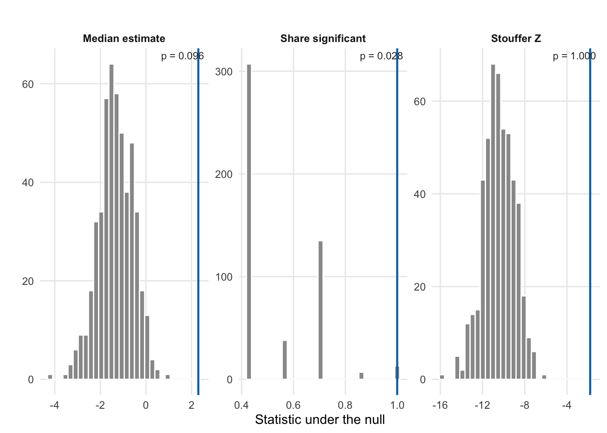

## Variance decomposition

A related question: of all the spread in the curve, how much is each
control responsible for? `sca_variance()` decomposes the variance of the
focal coefficient across the curve into the share attributable to each
control (plus a residual for interactions among choices and unexplained
variation). By default it uses an LMG / Shapley decomposition of R²,
whose shares sum exactly to the model R² and don’t depend on the order
you list the controls:

``` r
sca_variance(s)
#>         choice   variance    percent
#> 1        O2Sat 3.58410425 28.8469584
#> 2       SiO3uM 2.69567901 21.6963947
#> 3       ChlorA 1.78621832 14.3765254
#> 4        NH3uM 0.54315852  4.3716561
#> 5 NO2uM:SiO3uM 0.22713979  1.8281533
#> 6        NO2uM 0.05075694  0.4085214
#> 7     Residual 3.53749134 28.4717906
```

`plot_variance()` shows the same thing as a bar chart:

``` r
plot_variance(s)
```

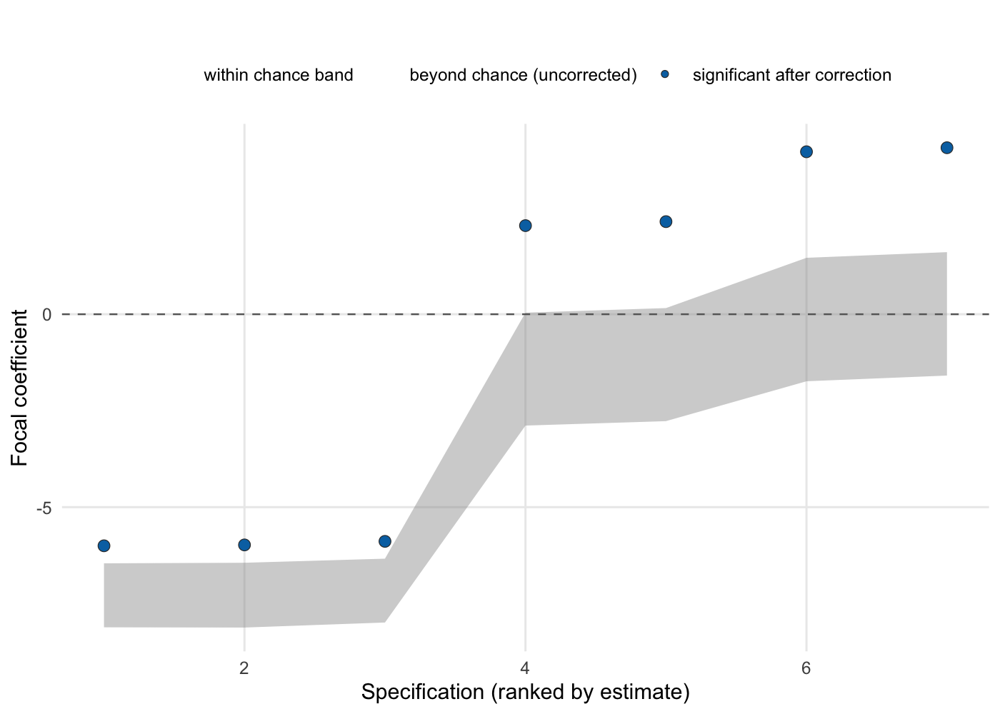

## Joint-inference test

Reading a specification curve tells you whether your result is robust
*descriptively*. But how do you know the curve as a whole is more
extreme than you’d expect by chance? `sca_test()` answers that with the
permutation-based joint-inference test of Simonsohn, Simmons, and Nelson
(2020). It tests the sharp null that the focal variable has no effect in
*any* specification: it repeatedly shuffles that variable (blocked
within fixed effects when present), re-estimates the entire curve each
time, and compares the observed curve to the resulting null
distribution.

It reports three statistics–the median estimate, the share of
statistically significant specifications (restricted to the predicted
direction when you set `direction`), and a Stouffer combination of the
per-specification *p*-values–each with its own permutation *p*-value:

``` r
result <- sca_test(y = "Salnty", x = "T_degC",
                   controls = c("O2Sat", "ChlorA", "NO2uM"),
                   data = bottles, n_permutations = 500, seed = 1,
                   progress_bar = FALSE)
result
#> Specification curve joint-inference test (Simonsohn, Simmons & Nelson 2020)
#> 
#> Focal variable:   T_degC
#> Specifications:   7
#> Permutations:     500 used (0 failed)   |  blocked within FE: no
#> Null:             shuffle x
#> Direction:        two.sided   alpha = 0.05
#> 
#>   Statistic                Observed    p-value
#>   Median estimate            0.0543     0.0020
#>   Share significant          1.0000     0.0040
#>   Stouffer Z                 0.9213     0.6547
#> 
#> p-values are permutation-based; resolution floor = 0.0020.
#> Interpretation (SSN): conclude a robust effect when the median test AND
#> at least one of {share significant, Stouffer} are significant.
```

`plot_sca_test()` shows each statistic’s null distribution with the
observed value marked, so you can see how far into the tail the real
curve sits:

``` r
plot_sca_test(result)
```

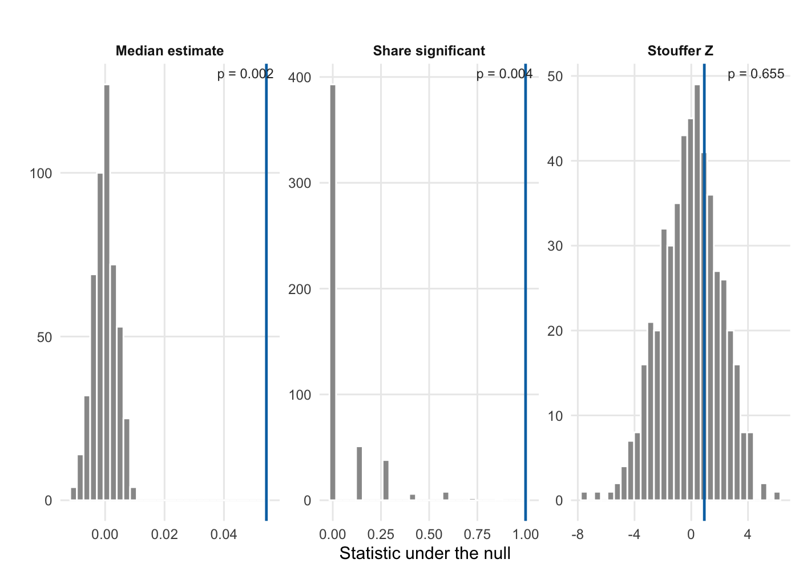

One caveat worth taking seriously: the default null shuffles the focal
variable, which also breaks its correlation with the controls. That’s
fine for an experiment where the variable really was randomly assigned,
but for observational data–where the focal variable is collinear with
the controls–it’s anti-conservative. For that case,
`null_type = "freedman_lane"` and `null_type = "residual_bootstrap"` are
design-preserving alternatives that hold the focal variable’s
correlation with the controls fixed. Both are for linear models and fit
every specification on a common sample.

### Which specifications are real?

The joint test asks whether the curve as a whole is real. The natural
follow-up is *which* specifications are. You can’t just read the
per-specification *p*-values off the curve and report the significant
ones–with dozens of correlated specifications, some are going to look
significant by chance. That’s the multiple-comparisons problem, now
spread across specifications.

`speccurvieR` corrects for it with the min-P / max-statistic permutation
method of Westfall and Young (1993). It reuses the permutations the
joint test already ran (so there’s nothing extra to compute) and, for
each one, records the most extreme specification anywhere in the curve,
building the null distribution of “the best result a search could turn
up by chance”. When you run `sca_test()` with `keep_curves = TRUE` and a
confound-preserving null, these family-wise-error-rate-adjusted
*p*-values are attached automatically:

``` r
result_fl <- sca_test(y = "Salnty", x = "T_degC",
                      controls = c("O2Sat", "ChlorA", "NO2uM"),
                      data = bottles, null_type = "freedman_lane",
                      n_permutations = 500, seed = 1, keep_curves = TRUE,
                      progress_bar = FALSE)

as.data.frame(result_fl, what = "specs")
#>                     spec    observed       p_raw       p_adj significant_adj
#> 1         ChlorA + NO2uM -0.06210476 0.015968064 0.045908184            TRUE
#> 2                  NO2uM -0.06199380 0.019960080 0.057884232           FALSE
#> 3                 ChlorA -0.06167098 0.015968064 0.045908184            TRUE
#> 4          NO2uM + O2Sat  0.03066608 0.001996008 0.001996008            TRUE
#> 5                  O2Sat  0.03141611 0.001996008 0.001996008            TRUE
#> 6 ChlorA + NO2uM + O2Sat  0.05577464 0.001996008 0.001996008            TRUE
#> 7         ChlorA + O2Sat  0.05610969 0.001996008 0.001996008            TRUE
```

`p_raw` is each specification’s uncorrected *p*-value against its own
null, `p_adj` is the corrected one, and `significant_adj` flags the
survivors. `plot_sca_test_specs()` draws each specification’s estimate
against its own null band and colours the points by which tier they fall
in–within the band, beyond it but not significant after correction, and
significant after correction:

``` r
plot_sca_test_specs(result_fl)
```

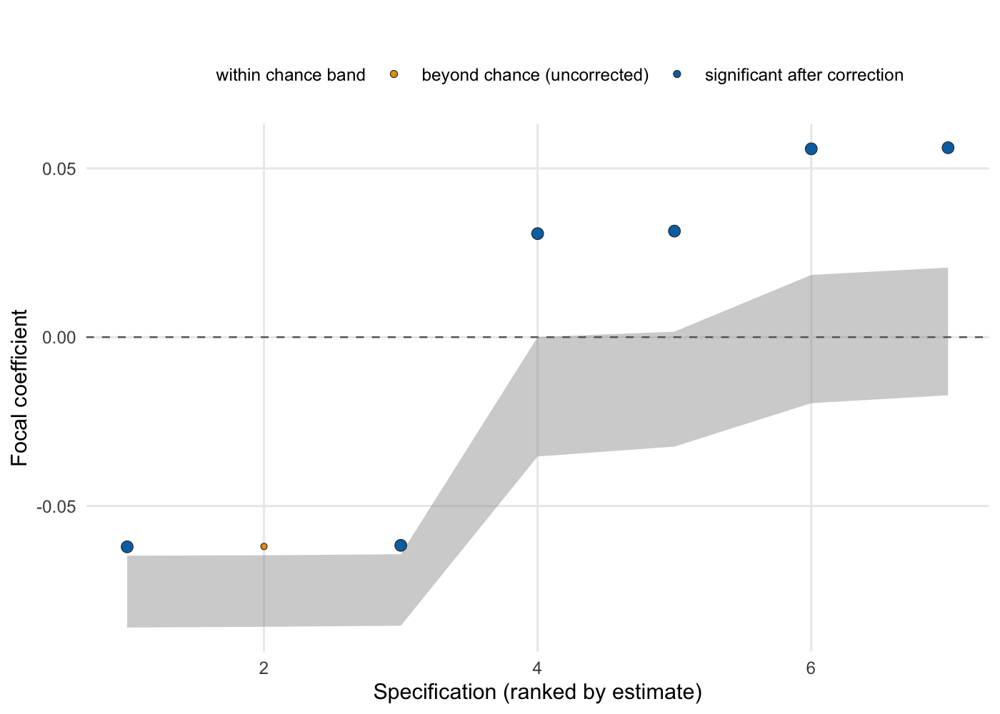

`sca_minp()` recomputes the adjustment without re-running the
permutations, if you want the more powerful Westfall-Young step-down
procedure or a different threshold. One honest caveat: a flagged
under-controlled specification means an association beyond its own
conditional null, *not* a causal effect of the size it reports–leaving
out a confounder reroutes part of the focal variable’s coefficient, and
the correction doesn’t undo that.

## Reporting and export

Once you’ve estimated and tested a curve, you probably need to get it
into a paper. The package speaks the usual `tidy()`/`glance()`
dialect–the same generics `broom` and `modelsummary` dispatch on, so no
extra dependency–for both `sca()` curves and `sca_test()` results:

``` r
tidy(result_fl)
#>                term    estimate    p.value direction     null_type
#> 1            median  0.03066608 0.07984032 two.sided freedman_lane
#> 2 share_significant  1.00000000 0.00998004 two.sided freedman_lane
#> 3          stouffer -1.80343387 1.00000000 two.sided freedman_lane
```

`sca_table()` renders a compact results block. It returns a plain,
dependency-free data frame by default, but it can also render to
Markdown, LaTeX, or `gt`/`kableExtra`/`flextable` if you have the
package installed:

``` r
sca_table(result_fl)
#> Focal variable                T_degC
#> Specifications                7
#> Observations                  common sample
#> Permutations                  500
#> Null hypothesis               Freedman-Lane (control superset, common sample)
#> Direction                     two.sided
#> alpha                         0.05
#> Median estimate               0.0307  (p = 0.0798)
#> Share significant             100.0%  (p = 0.0100)
#> Stouffer Z                    -1.8  (p = 1.0000)
#> Significant after correction  6 of 7
#> Smallest corrected p          0.0020
#> 
#> p-values are permutation-based; resolution floor = 0.0020.
```

And `sca_report()` writes a one-paragraph, manuscript-ready summary,
including the joint-inference verdict and the multiple-comparison count
when they’re available:

``` r
sca_report(result_fl)
#> [1] "A specification curve analysis estimated the effect of T_degC across 7 specifications on a common sample. The median estimate was 0.0307 (100.0% of specifications were statistically significant at the 0.05 level). Joint inference via Freedman-Lane permutation tests (500 permutations) did not reject the null of no effect: the median estimate (p = 0.0798), the share of significant specifications (p = 0.0100), and Stouffer's combined test (Z = -1.8, p = 1.0000). After family-wise error-rate correction for the 7 specifications searched, 6 remained significant (smallest adjusted p = 0.0020)."
```

# Other features

## Fixed effects with `fixest::feols`

Pass the name of your fixed effects variable(s) when calling `sca()` or
`se_compare()` and all models will be run with `feols()` from the
`fixest` package!

## Parallel computing

`sca()` uses the `parallel` package to offer parallel computing when
estimating models. Simply set `parallel = TRUE` and the number of
workers you want, i.e. `workers = 2`.

Note: parallelization is only recommended for specification curve
analysis involving very large (\>1000) numbers of models–for less
intensive tasks parallelization will actually slow down model
estimation.

## Getting formulae

If you hate the plotting functions I’ve made or need something from the
model not provided by the default output of `sca()` you can always have
it just return a list of all possible formulae with
`return_formulae = TRUE`:

``` r
formulae <- sca(y = "T_degC", x = "Salnty",
         controls = c("O2Sat", "NO2uM", "SiO3uM"),
         data = bottles, return_formulae = TRUE)

formulae
#> $`T_degC ~ Salnty + O2Sat`
#> T_degC ~ Salnty + O2Sat
#> <environment: 0x12b417c60>
#> 
#> $`T_degC ~ Salnty + NO2uM`
#> T_degC ~ Salnty + NO2uM
#> <environment: 0x12b417c60>
#> 
#> $`T_degC ~ Salnty + SiO3uM`
#> T_degC ~ Salnty + SiO3uM
#> <environment: 0x12b417c60>
#> 
#> $`T_degC ~ Salnty + O2Sat + NO2uM`
#> T_degC ~ Salnty + O2Sat + NO2uM
#> <environment: 0x12b417c60>
#> 
#> $`T_degC ~ Salnty + O2Sat + SiO3uM`
#> T_degC ~ Salnty + O2Sat + SiO3uM
#> <environment: 0x12b417c60>
#> 
#> $`T_degC ~ Salnty + NO2uM + SiO3uM`
#> T_degC ~ Salnty + NO2uM + SiO3uM
#> <environment: 0x12b417c60>
#> 
#> $`T_degC ~ Salnty + O2Sat + NO2uM + SiO3uM`
#> T_degC ~ Salnty + O2Sat + NO2uM + SiO3uM
#> <environment: 0x12b417c60>
```

Then it’s easy to estimate the models yourself with the pre-made
formulae:

``` r
my_own_models <- lapply(formulae, lm, data = bottles)

summary(my_own_models[[1]])
#> 
#> Call:
#> FUN(formula = X[[i]], data = ..1)
#> 
#> Residuals:
#>     Min      1Q  Median      3Q     Max 
#> -7.9361 -0.8102  0.0100  0.8297  7.7782 
#> 
#> Coefficients:
#>               Estimate Std. Error t value Pr(>|t|)    
#> (Intercept) -122.25866   12.59424  -9.708   <2e-16 ***
#> Salnty         3.71490    0.36636  10.140   <2e-16 ***
#> O2Sat          0.13018    0.00426  30.559   <2e-16 ***
#> ---
#> Signif. codes:  0 '***' 0.001 '**' 0.01 '*' 0.05 '.' 0.1 ' ' 1
#> 
#> Residual standard error: 1.757 on 368 degrees of freedom
#>   (129 observations deleted due to missingness)
#> Multiple R-squared:  0.8137, Adjusted R-squared:  0.8127 
#> F-statistic: 803.9 on 2 and 368 DF,  p-value: < 2.2e-16
```

# What’s next?

Feel free to contact me at <zayne@mit.edu> to let me know of features
you would find useful. Some directions I may add next:

- Two-way and multiway clustered standard errors in `se_compare()`
- Support for pre-fitted models and custom estimators
  (e.g. instrumental-variables, survival, and mixed models)

If you find a bug please create an issue on GitHub and I’ll work to fix
it ASAP.
